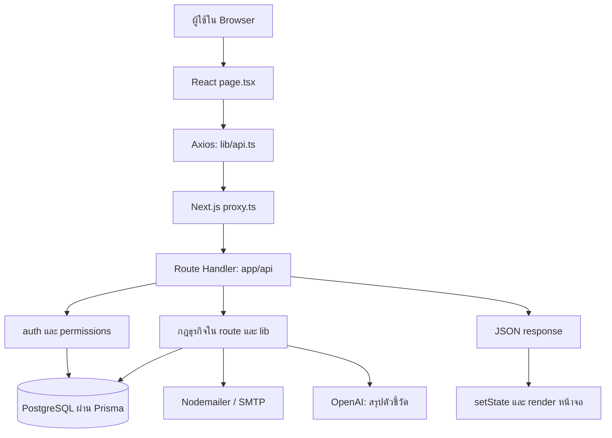
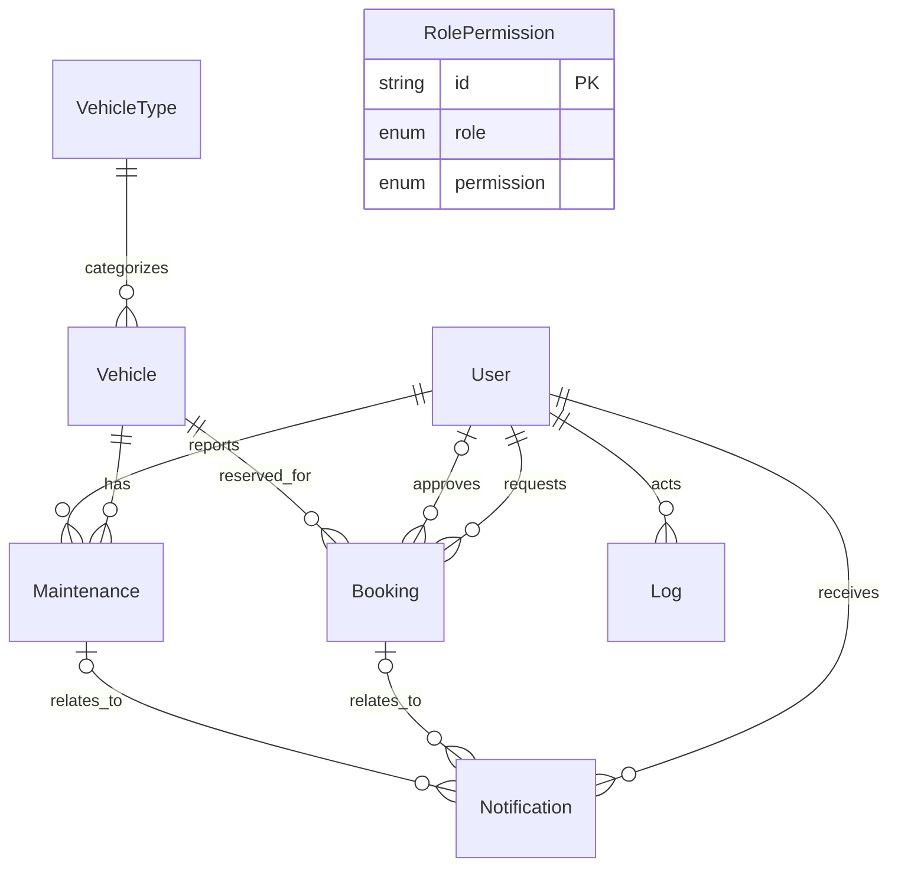

# บทที่ 1 — ภาพรวม โครงสร้าง และฐานข้อมูล

อ้างอิงโค้ดใน working tree วันที่ 5 กันยายน 2026 รวมไฟล์ที่แก้ไขอยู่และยังไม่ commit คู่มือนี้อธิบายพฤติกรรมจากโค้ด ไม่ได้ยืนยันว่าฐานข้อมูลที่กำลังใช้งานมี migration ครบแล้ว

## 1. ระบบนี้แก้ปัญหาอะไร

ระบบจัดการยานพาหนะขององค์กรรวบรวมข้อมูลรถ การขอใช้รถ การอนุมัติ การรับ–คืนรถ และการซ่อมบำรุงไว้ด้วยกัน เมื่อมีประวัติการใช้งานแล้ว ผู้ดูแลระบบสามารถดูจำนวนเที่ยว ระยะทาง และงานซ่อม รวมถึงขอให้ AI ช่วยสรุปข้อมูลเพื่อประกอบการตัดสินใจ

ผู้ใช้มีสามบทบาท แต่ละบัญชีมีบทบาทเดียว:

| บทบาท | หน้าที่ตามหน้าจอหลัก | ข้อมูลที่เกี่ยวข้อง |
|---|---|---|
| `USER` | ค้นหารถ ส่งคำขอ ดูการจองของตน แก้ไข/ยกเลิกคำขอ รับ–คืนรถ และแจ้งซ่อม | การจองของตนและงานซ่อมที่ตนแจ้ง |
| `APPROVER` | พิจารณาคำขอ และดูประวัติที่ตนเป็นผู้พิจารณา | คำขอรออนุมัติและรายการที่มี `approverId` เป็นตน |
| `ADMIN` | จัดการผู้ใช้ รถ ประเภทรถ การจอง งานซ่อม สิทธิ์ และรายงาน | ข้อมูลระดับองค์กรตาม permission ที่มี |

คำอธิบายตอนสอบ: “ระบบแยกผู้ขอใช้ ผู้พิจารณา และผู้ดูแลข้อมูล โดยตรวจทั้งบทบาท สิทธิ์รายงาน และความเป็นเจ้าของรายการจากฝั่งเซิร์ฟเวอร์”

## 2. สถาปัตยกรรม

เป็นแอป Next.js ที่มี frontend และ backend อยู่ใน repository เดียว ใช้ PostgreSQL เก็บข้อมูลถาวร และใช้ Prisma เป็นตัวกลางเข้าถึงข้อมูล ไม่ได้มี Express server แยกอีกโครงการ



แผนภาพนี้เป็นเส้นทางการเรียก API ส่วนการเปิดหน้าที่มีการป้องกันยังผ่าน `layout.tsx` และ `requirePageAccess()` ก่อนแสดงเนื้อหาด้วย

ตัวอย่าง: ผู้ใช้กด “ส่งคำขอ” → `submitBooking()` → `api.post('/api/booking', bookingData)` → `POST()` ใน route → `requireAccess()` → ตรวจรถ/ช่วงเวลา → `prisma.booking.create()` → ส่งข้อมูลกลับ → หน้าจอแสดงข้อความสำเร็จและค้นหารถใหม่

## 3. เทคโนโลยีที่ใช้จริง

เวอร์ชันต่อไปนี้เป็นค่าที่ประกาศใน [package.json](/Users/chatchaponchuwongwut/Desktop/mut/project_1/vehicle-management/package.json) เครื่องหมาย `^` อนุญาตช่วงเวอร์ชัน จึงไม่ควรใช้ตารางนี้แทนการตรวจเวอร์ชันที่ติดตั้งจริง

| เทคโนโลยี | ค่าที่ประกาศ | ใช้ทำอะไรในโปรเจกต์ |
|---|---|---|
| Next.js | `16.1.1` | routing, page/layout, API route และ server runtime |
| React / React DOM | `19.2.3` | component, state และการแสดงผล |
| TypeScript | `^5.9.3` | ระบุชนิดข้อมูลและตรวจความสอดคล้องตอนพัฒนา |
| Tailwind CSS | `^4` | จัด layout สี spacing responsive และสถานะปุ่มผ่าน class |
| Prisma | `^7.2.0` | schema, migrations และ query ที่มีชนิดข้อมูล |
| PostgreSQL | Docker ระบุ `15` | ฐานข้อมูลเชิงสัมพันธ์ |
| `@prisma/adapter-pg`, `pg` | ตาม package | เชื่อม Prisma กับ PostgreSQL; `pg` ยังใช้ใน E2E เตรียมข้อมูล |
| Axios | `^1.13.2` | ส่ง HTTP request จาก browser |
| bcrypt / bcryptjs | `^6.0.0` / `^3.0.3` | hash และตรวจรหัสผ่าน; มีการใช้ทั้งสอง package ในคนละไฟล์ |
| jsonwebtoken | `^9.0.3` | ลงลายเซ็นและตรวจ JWT |
| Lucide React | `^0.574.0` | ไอคอน เช่น รถ ประแจ แม่กุญแจ |
| Recharts | `^3.8.1` | กราฟแท่งในหน้าประวัติรถ |
| Nodemailer | `^8.0.11` | ส่งอีเมลผ่าน SMTP |
| OpenAI SDK | `^7.5.0` | เรียกบริการสร้างข้อความสรุป |
| Zod | `^4.4.3` | ตรวจข้อมูล request และโครงสร้างผลลัพธ์ AI ตอน runtime |
| Vitest | `^4.1.2` | ทดสอบฟังก์ชันและ route โดย mock ส่วนภายนอก |
| Playwright | `^1.61.1` | ทดสอบลำดับการใช้งานผ่าน browser |

TypeScript ตรวจชนิดระหว่างพัฒนา แต่ข้อมูลจาก HTTP อาจผิดชนิดได้จริง จึงยังต้องมีการตรวจใน route เช่น `typeof`, `Number.isInteger`, หรือ Zod

## 4. โครงสร้างโฟลเดอร์

```text
vehicle-management/
├── app/
│   ├── layout.tsx               กรอบใหญ่ของเว็บและ Navbar
│   ├── page.tsx                 หน้าเข้าสู่ระบบ /
│   ├── globals.css              Tailwind และ CSS กลาง
│   ├── component/               Navbar และ dashboard ที่ใช้ร่วมกัน
│   ├── user/                    หน้าของผู้ขอใช้รถ
│   ├── approver/                หน้าของผู้อนุมัติ
│   ├── admin/                   หน้าผู้ดูแลและรายงาน
│   ├── forbidden/               หน้าแจ้งว่าไม่มีสิทธิ์
│   ├── api/                     backend endpoints
│   └── generated/prisma/        Prisma Client ที่เครื่องมือสร้าง
├── lib/
│   ├── auth.ts                  ยืนยันตัวตนและอ่านผู้ใช้ล่าสุด
│   ├── permissions.ts           ตรวจบทบาทและสิทธิ์
│   ├── page-access.ts           ป้องกันหน้าเว็บฝั่ง server
│   ├── use-permissions.ts       hook ใช้สิทธิ์แสดง/ซ่อนปุ่ม
│   ├── prisma.ts                Prisma Client กลาง
│   ├── api.ts                   Axios instance กลาง
│   ├── syncStatuses.ts          ปรับสถานะรถและงานซ่อมตามข้อมูล/เวลา
│   ├── format.ts                แปลสถานะ สี และวันที่
│   ├── email/                   notification และอีเมล
│   ├── vehicle-usage-analysis/   คำนวณตัวชี้วัด
│   ├── vehicle-history-details/ รายละเอียดและแบ่งหน้าประวัติ
│   ├── ai/vehicle-usage-summary/ เตรียมข้อมูล เรียก AI ตรวจคำตอบ
│   ├── __tests__/               tests ของ utility
│   └── __mocks__/               mock Prisma ที่ใช้ซ้ำได้
├── prisma/
│   ├── schema.prisma            โครงสร้างข้อมูลปัจจุบัน
│   ├── migrations/              SQL เปลี่ยนฐานข้อมูลตามลำดับ
│   ├── seed.ts                  ข้อมูลตั้งต้น
│   └── seedPermissions.ts       สิทธิ์ตั้งต้นของแต่ละบทบาท
├── e2e/                         Playwright scenarios
├── public/                      ภาพ/โลโก้/SVG
├── docs/                        แผน การตัดสินใจ และคู่มือนี้
├── proxy.ts                     ด่านตรวจ cookie ก่อนเข้า route
├── prisma.config.ts             ตำแหน่ง schema/migrations และ DB URL
├── package.json                 dependencies และคำสั่ง npm
├── package-lock.json            รายละเอียด dependency ที่ล็อกไว้
├── tsconfig.json                TypeScript และ alias @/
├── next.config.ts               การตั้งค่า Next.js
├── postcss.config.mjs           เชื่อม Tailwind กับ PostCSS
├── eslint.config.mjs            กฎตรวจโค้ด
├── vitest.config.ts             การตั้งค่า unit/API tests
├── playwright.config.ts         การตั้งค่า E2E
├── docker-compose.yml           PostgreSQL สำหรับพัฒนา
└── .env.example                 ชื่อตัวแปรแวดล้อมตัวอย่าง
```

`page.tsx` คือหน้าที่มี URL ตามโฟลเดอร์ เช่น `app/user/booking/page.tsx` เป็น `/user/booking` ส่วน `app/api/booking/route.ts` เป็น `/api/booking` และแบ่งงานด้วย HTTP method

`layout.tsx` ห่อหน้าลูกผ่าน `children` เช่นหน้า `/admin/bookings` อยู่ใต้ root layout → admin layout → bookings layout → page จึงตรวจ role และ permission คนละชั้นได้

`app/generated/prisma` เป็นโค้ดจาก schema มี `client.ts` สำหรับ server, `browser.ts` สำหรับ exports ที่ใช้ใน browser, `enums.ts`, `models/*.ts`, input types และ internal runtime ไม่ใช่หน้าเว็บแม้อยู่ใน `app/` เพราะไม่มี `page.tsx` หรือ `route.ts` ในโครงสร้างนั้น

`.next/` เป็นผลจากการพัฒนา/build และ `node_modules/` เป็น dependencies ไม่ใช่ business logic ที่ต้องเขียนเอง ส่วนไฟล์ `.DS_Store` เป็น metadata ของ macOS

## 5. อ่านภาษา Prisma ให้เป็น

เปิด [schema.prisma](/Users/chatchaponchuwongwut/Desktop/mut/project_1/vehicle-management/prisma/schema.prisma) เทียบกับคำอธิบายนี้

```prisma
id          String    @id @default(uuid())
email       String    @unique
returnedAt  DateTime?
bookings    Booking[]
```

| รูปแบบ | ความหมาย |
|---|---|
| `model` | entity ที่ map ไปเป็นตาราง |
| `enum` | ชุดค่าที่อนุญาต เช่น status หรือ role |
| `String`, `Int`, `Float`, `Boolean`, `DateTime`, `Json` | ชนิดข้อมูล |
| `?` | ฟิลด์ยอมให้เป็น `null` |
| `[]` | relation แบบหลายรายการ ไม่ใช่ array column ในกรณีนี้ |
| `@id` | primary key ระบุแถว |
| `@default(uuid())` | ให้ Prisma สร้างรหัส UUID เมื่อสร้างข้อมูลผ่าน client |
| `@unique` | ค่าห้ามซ้ำในตาราง |
| `@default(now())` | เวลาเริ่มต้นเมื่อสร้างแถว |
| `@updatedAt` | Prisma ดูแลเวลาอัปเดตเมื่อแก้ผ่าน Prisma ไม่ใช่ trigger ครอบคลุม SQL ทุกทาง |
| `@relation(fields: [...], references: [...])` | ระบุ foreign key และ key ที่อ้างถึง |
| `@@index([...])` | index ระดับตารางช่วย query |
| `@@unique([role, permission])` | คู่บทบาทกับสิทธิ์ห้ามซ้ำ |

ข้อควรรู้: ใน migrations นี้ UUID ถูกเก็บเป็น `TEXT` และ `DateTime` เป็น `TIMESTAMP(3)` ไม่ได้ประกาศ `@db.Uuid` หรือ `@db.Timestamptz` ดังนั้นอย่าอธิบายว่าฐานข้อมูลใช้ชนิด UUID หรือ timestamp with time zone โดยอัตโนมัติ

`datasource db` ระบุ PostgreSQL ส่วน URL อยู่ใน `prisma.config.ts` และ `DATABASE_URL` สำหรับ runtime จะถูกอ่านอีกครั้งใน `lib/prisma.ts`

## 6. ความสัมพันธ์ของทั้ง 8 ตาราง



ความสัมพันธ์ `User` กับ `Booking` มีสองความหมาย: `userId` คือผู้ขอใช้ และ `approverId` คือผู้พิจารณา จึงตั้งชื่อ relation ฝั่งผู้พิจารณาว่า `"Approver"` เพื่อไม่ให้ Prisma สับสน

`RolePermission` ไม่ได้มี foreign key ไป `User` แต่เชื่อมกันทางค่า enum `User.role` เช่นผู้ใช้ทุกคนที่มี `role = USER` ใช้ชุดสิทธิ์ของ `USER` ร่วมกัน เป็นสิทธิ์ระดับบทบาท ไม่มีตารางสิทธิ์แยกรายบุคคล

### 6.1 User — บัญชีผู้ใช้

| ฟิลด์ | ชนิด/กฎ | ความหมายและใช้ที่ไหน |
|---|---|---|
| `id` | String, PK, UUID | อ้างใน JWT, ผู้จอง ผู้อนุมัติ ผู้แจ้งซ่อม และ log |
| `name` | String | ชื่อแสดงบน Navbar ตาราง และข้อมูลสรุป AI |
| `email` | String, unique | ชื่อเข้าใช้และที่อยู่อีเมลแจ้งเตือน |
| `password` | String | bcrypt hash; route login ใช้ compare |
| `role` | UserRole | USER / ADMIN / APPROVER |
| `isActive` | Boolean, default true | ปิดบัญชีโดยยังเก็บประวัติไว้ |
| `deactivatedAt` | DateTime? | เวลาเมื่อปิดบัญชี; เปิดใหม่เป็น null |
| `createdAt` | DateTime, now | เวลาสร้างบัญชี ใช้เรียงรายการ |
| `bookings` | Booking[] | รายการที่ผู้ใช้นี้เป็นผู้ขอ |
| `approvedJobs` | Booking[], relation Approver | รายการที่ผู้ใช้นี้เป็นผู้พิจารณา |
| `maintenances` | Maintenance[] | งานซ่อมที่เป็นผู้แจ้ง |
| `notifications` | Notification[] | การแจ้งเตือนที่รับ |
| `logs` | Log[] | กิจกรรมที่ทำ |

`isActive = false` ไม่ลบ Booking และไม่ได้ยกเลิกการจองอัตโนมัติ เหตุผลคือระบบต้องรักษาประวัติและให้ Admin จัดการงานค้างต่อได้

### 6.2 VehicleType — ประเภทรถ

| ฟิลด์ | ชนิด | ความหมาย |
|---|---|---|
| `id` | String, PK | รหัสประเภท |
| `name` | String | ชื่อประเภท เช่น Van / Truck ตาม seed |
| `vehicles` | Vehicle[] | รถทุกคันในประเภทนี้ |

แยกประเภทเป็นตารางเพื่อให้รถหลายคันอ้างอิงข้อมูลกลาง การแก้ชื่อประเภทจึงเปลี่ยนจุดเดียว ใช้ทั้งค้นหารถและจัดกลุ่มรถเทียบเคียงในรายงาน `name` ยังไม่ได้กำหนด unique ใน schema

### 6.3 Vehicle — รถแต่ละคัน

| ฟิลด์ | ชนิด/กฎ | ความหมาย |
|---|---|---|
| `id` | String, PK | รหัสภายในของรถ |
| `plateNumber` | String, unique | ทะเบียนรถ |
| `status` | VehicleStatus, default AVAILABLE | สถานะปัจจุบันของรถ |
| `currentMileage` | Int, default 0 | เลขหน้าปัดล่าสุดที่ระบบบันทึก |
| `typeId` | String, FK | อ้าง VehicleType.id |
| `type` | VehicleType | relation เพื่ออ่านข้อมูลประเภท |
| `bookings`, `maintenances` | relation arrays | ประวัติการจองและการซ่อม |

`currentMileage` ไม่ใช่ระยะทางของเดือนที่เลือก เช่นหน้าปัด 50,000 กม. แต่เที่ยวในเดือนนี้รวม 300 กม. เป็นคนละตัวชี้วัด เมื่อคืนรถระบบนำ `mileageEnd` ไปอัปเดตเลขหน้าปัดนี้

### 6.4 Booking — คำขอและหลักฐานการใช้รถ

| ฟิลด์ | ชนิด/กฎ | ความหมาย |
|---|---|---|
| `id` | String, PK | รหัสรายการเดียวตั้งแต่จองถึงคืน |
| `userId` | String, FK | ผู้ขอใช้รถ |
| `vehicleId` | String, FK | รถที่จอง/ได้รับการจัดสรรล่าสุด |
| `approverId` | String?, FK | ผู้พิจารณา; ยังไม่มีได้ขณะรออนุมัติ |
| `startDate`, `endDate` | DateTime | กำหนดเริ่มและสิ้นสุดการจอง |
| `purpose` | String | วัตถุประสงค์ ต้องส่งตอนจอง |
| `destination` | String? | ปลายทาง; API trim และจำกัด 255 ตัวอักษร |
| `status` | BookingStatus, default PENDING | ขั้นตอนของรายการ |
| `rejectionReason` | String? | เหตุผลปฏิเสธจากเส้นทาง approver |
| `mileageStart`, `mileageEnd` | Int? | เลขหน้าปัดตอนรับและคืน |
| `pickedUpAt`, `returnedAt` | DateTime? | เวลารับและคืนจริงจาก server |
| `createdAt` | DateTime, now | เวลาส่งคำขอ |
| `updatedAt` | DateTime, now + updatedAt | เวลาแก้ล่าสุด ไม่ใช่เวลาอนุมัติโดยเฉพาะ |
| `user`, `vehicle`, `approver` | relations | อ่านเจ้าของ รถ และผู้พิจารณา |
| `notifications` | Notification[] | การแจ้งเตือนที่เกี่ยวกับรายการ |

ไม่แยกตาราง Trip เพราะรุ่นนี้เก็บวงจรคำขอและการใช้จริงใน Booking เดียว ฟิลด์รับ–คืนจึงต้อง nullable: ตอนเพิ่งจองยังไม่มีข้อมูลเหล่านั้น

`@@index([vehicleId, startDate, endDate])` ช่วยค้นหาคำขอของรถตามเวลา แต่ไม่ใช่ constraint ที่ป้องกันช่วงเวลาทับซ้อนด้วยตัวเอง การกันช่วงซ้ำอยู่ใน route

เมื่อเปลี่ยนรถ `vehicleId` ถูกแทนด้วยรถใหม่และ status เป็น `CHANGED` รถเดิมอยู่ในข้อความ Log ไม่ได้มีตารางประวัติการเปลี่ยนรถแยกต่างหาก

### 6.5 Maintenance — งานซ่อมและบำรุงรักษา

| ฟิลด์ | ชนิด/กฎ | ความหมาย |
|---|---|---|
| `id` | String, PK | รหัสงาน |
| `vehicleId` | String, FK | รถที่ต้องดูแล |
| `reporterId` | String, FK | ผู้แจ้ง; อาจเป็น USER หรือ ADMIN |
| `description` | String | อาการ/รายละเอียดที่แจ้ง |
| `repairDetails` | String? | สิ่งที่ทำในการซ่อม |
| `serviceCenterName` | String? | ชื่อศูนย์หรือผู้ให้บริการ |
| `cost` | Float? | ค่าใช้จ่าย; null = ไม่ทราบ, 0 = ระบุว่าไม่มีค่าใช้จ่าย |
| `maintenanceType` | MaintenanceType, default UNSPECIFIED | ลักษณะงาน |
| `status` | MaintenanceStatus, default REPORTED | ความคืบหน้าของงาน |
| `startDate` | DateTime | วันเริ่ม/กำหนดเริ่มงาน |
| `endDate` | DateTime? | วันเสร็จ; null หมายถึงยังไม่ระบุขอบเขตสิ้นสุด |
| `vehicle`, `reporter`, `notifications` | relations | รถ ผู้แจ้ง และการแจ้งเตือน |

ตารางนี้ไม่มี `createdAt` และ `updatedAt` ใน schema ปัจจุบัน แม้บาง type ในหน้าเว็บจะประกาศ `createdAt` ไว้ก็ไม่ได้ทำให้เกิดคอลัมน์จริง

`maintenanceType` ต่างจาก `status`: ตัวแรกตอบว่า “ซ่อมแบบไหน” ตัวหลังตอบว่า “ทำถึงไหนแล้ว” เช่น BREAKDOWN + COMPLETED คือซ่อมจากความขัดข้องที่ทำเสร็จแล้ว

### 6.6 Notification — ข้อความแจ้งเตือนในระบบ

| ฟิลด์ | ชนิด/กฎ | ความหมาย |
|---|---|---|
| `id` | String, PK | รหัสข้อความ |
| `userId` | String, FK | ผู้รับข้อความ |
| `type` | NotificationType | BOOKING / MAINTENANCE / SYSTEM |
| `message` | String | ข้อความที่ Navbar แสดง |
| `isRead` | Boolean, default false | อ่านแล้วหรือยัง |
| `bookingId` | String?, FK | รายการจองที่เกี่ยวข้อง |
| `maintenanceId` | String?, FK | งานซ่อมที่เกี่ยวข้อง |
| `createdAt` | DateTime, now | เวลาแจ้งเตือน |
| `user`, `booking`, `maintenance` | relations | ข้อมูลที่เชื่อม |

หนึ่งการจองมีหลายข้อความได้ เช่นอนุมัติ รับรถ และคืนรถ แต่ละข้อความมีผู้รับหนึ่งบัญชี อีเมลเป็นอีกช่องทาง ไม่ใช่แถวแยกในตารางนี้

### 6.7 Log — บันทึกกิจกรรม

| ฟิลด์ | ชนิด/กฎ | ความหมาย |
|---|---|---|
| `id` | String, PK | รหัส log |
| `userId` | String, FK | ผู้ทำกิจกรรม |
| `action` | String | ชื่อเหตุการณ์หรือข้อความ เช่น ROLE_PERMISSIONS_UPDATED |
| `metadata` | Json? | ข้อมูลเพิ่มเติม เช่นสิทธิ์ที่เพิ่ม/ลบ หรือเวลาที่ AI ใช้ |
| `createdAt` | DateTime, now | เวลาเกิดเหตุการณ์ |
| `user` | User | relation ผู้ทำ |

`Notification` มีไว้แจ้งผู้ใช้ ส่วน `Log` มีไว้ย้อนตรวจเหตุการณ์ บาง route เขียน Log แต่ไม่ได้ครอบคลุมทุก mutation และไม่มีหน้าอ่าน Log โดยเฉพาะใน route ที่ตรวจพบ

### 6.8 RolePermission — ตารางสิทธิ์

| ฟิลด์ | ชนิด/กฎ | ความหมาย |
|---|---|---|
| `id` | String, PK | รหัสแถว |
| `role` | UserRole | บทบาทที่ได้สิทธิ์ |
| `permission` | Permission | ความสามารถที่เปิดให้ |

มีแถว = ได้สิทธิ์ ไม่มีแถว = ไม่ได้สิทธิ์ เช่น `(USER, BOOKING_CREATE)` เปิดให้ USER สร้างคำขอ ชุด `(role, permission)` เป็น unique จึงมีแถวซ้ำไม่ได้

## 7. สถานะทั้งหมด

| Enum | ค่าและความหมาย |
|---|---|
| UserRole | USER ผู้ขอใช้, APPROVER ผู้พิจารณา, ADMIN ผู้ดูแล |
| VehicleStatus | AVAILABLE ว่าง, BOOKED จองแล้ว, IN_USE รับไปใช้งาน, MAINTENANCE อยู่ในงานซ่อม |
| BookingStatus | PENDING รอ, APPROVED อนุมัติ, REJECTED ปฏิเสธ, CANCELLED ยกเลิก, CHANGED เปลี่ยนรถ, IN_PROGRESS ใช้จริง, COMPLETED คืนแล้ว/จบรายการ |
| MaintenanceStatus | REPORTED รายงาน/รอกำหนด, IN_PROGRESS ดำเนินการ, COMPLETED เสร็จ |
| MaintenanceType | BREAKDOWN ขัดข้อง, PREVENTIVE ตามรอบ, OTHER อื่น ๆ, UNSPECIFIED ข้อมูลเดิมยังไม่จำแนก |
| NotificationType | BOOKING เกี่ยวกับจอง, MAINTENANCE เกี่ยวกับซ่อม, SYSTEM ข้อความระบบ |

ชื่อ `IN_PROGRESS` ปรากฏทั้ง Booking และ Maintenance แต่เป็นคนละ enum และอธิบายคนละกระบวนการ

## 8. ความสัมพันธ์ช่วยคุ้มครองข้อมูลอย่างไร

Foreign key ป้องกันการอ้าง user/vehicle/type ที่ไม่มีอยู่ การลบ VehicleType ที่มีรถจะถูก API ปฏิเสธ การลบรถที่มี Booking หรือ Maintenance จะถูกปฏิเสธเช่นกัน ส่วน User ที่มีประวัติจะใช้การปิดบัญชีแทน

จาก SQL migration, relation บังคับหลายตัวใช้ `ON DELETE RESTRICT`; relation nullable เช่น `Notification.bookingId`, `Notification.maintenanceId`, `Booking.approverId` ใช้ `SET NULL` การลบข้อมูลแม่จึงอาจทำให้ relation ว่าง แทนที่จะลบข้อความแจ้งเตือนตามไปด้วย

## 9. Schema, migration และ seed ต่างกันอย่างไร

Schema อธิบายโครงสร้างที่ต้องการในปัจจุบัน Migration อธิบายขั้นตอน SQL ที่พาฐานข้อมูลจากเวอร์ชันหนึ่งไปอีกเวอร์ชัน Seed เติมข้อมูลตั้งต้นลงโครงสร้างนั้น

| Migration | สิ่งที่เพิ่ม |
|---|---|
| `20251227141528_init_vehicle_system` | ตารางหลัก 7 ตาราง enum และ foreign keys |
| `20251227143507_add_user_auth` | password |
| `20260420151117_add_vehicle_assignment_usage` | สถานะรับ–คืน เลขไมล์ purpose rejectionReason updatedAt และ RolePermission |
| `20260424140517_enhance_maintenance` | รายละเอียดซ่อม ศูนย์บริการ ค่าใช้จ่าย |
| `20260822090000_add_maintenance_type_and_log_metadata` | ประเภทงานซ่อมและ Log.metadata |
| `20260829090000_add_user_lifecycle` | isActive และ deactivatedAt |
| `20260902143000_add_booking_destination` | destination |
| `20260903120000_enforce_permission_matrix` | enum สิทธิ์เพิ่ม 3 ค่า |
| `20260903120100_seed_enforced_permissions` | เติมสิทธิ์ที่เพิ่มและถอด REPORT_VIEW ของ APPROVER |

[seed.ts](/Users/chatchaponchuwongwut/Desktop/mut/project_1/vehicle-management/prisma/seed.ts) สร้าง Admin ตั้งต้น ประเภทรถ 3 แบบ และรถตัวอย่าง 3 คัน โดยตรวจของเดิมก่อนสร้าง ไม่สร้างบัญชีทดสอบ USER/APPROVER ที่หน้า login แสดงไว้ทั้งหมด

[seedPermissions.ts](/Users/chatchaponchuwongwut/Desktop/mut/project_1/vehicle-management/prisma/seedPermissions.ts) ใช้ `upsert` เพิ่มสิทธิ์ตั้งต้นตามบทบาท การรันซ้ำไม่สร้างคู่ซ้ำ แต่สามารถเปิดสิทธิ์เริ่มต้นที่เคยถอดออกกลับมาได้ ไฟล์นี้ไม่ได้ถูกเรียกจาก `seed.ts` โดยตรง และคำสั่ง seed ใน Prisma config ชี้ไป `seed.ts`

`prisma generate` สร้าง client จาก schema โดยไม่ใช่การ migrate ฐานข้อมูล ส่วน `prisma migrate dev` ใช้จัดการ migration ในสภาพแวดล้อมพัฒนา คู่มือนี้ไม่ได้รัน migrate หรือ seed
