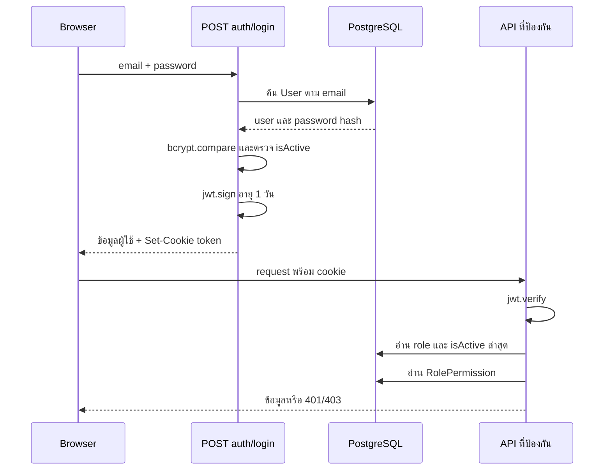
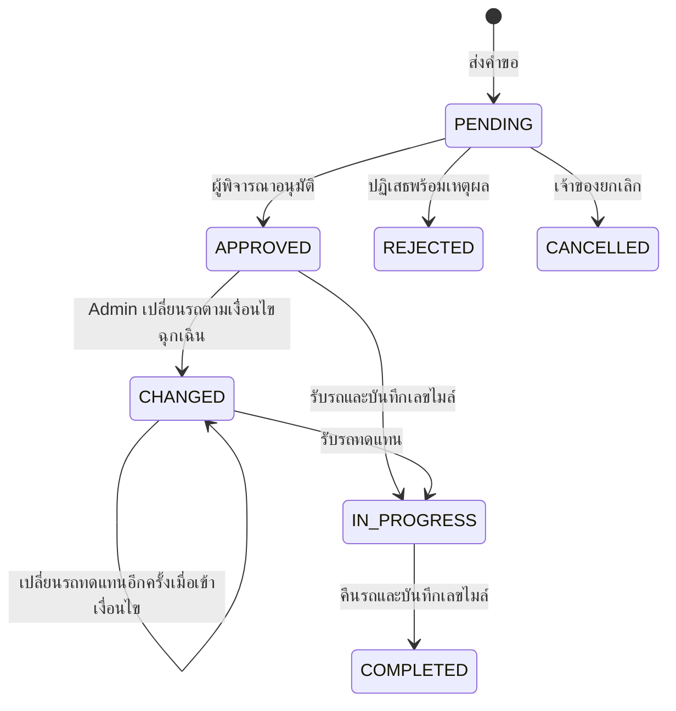

# บทที่ 3 — ยืนยันตัวตน สิทธิ์ API และการไหลของข้อมูล

## 1. HTTP และ Route Handler

ไฟล์ `app/api/.../route.ts` export ฟังก์ชันชื่อ `GET`, `POST`, `PUT`, `PATCH`, `DELETE` ให้ Next.js เลือกเรียกตาม HTTP method หนึ่ง URL จึงทำได้หลายงาน

| Method | ตัวอย่างการใช้ในโปรเจกต์ |
|---|---|
| GET | อ่านรายการ ค้นหารถ และอ่านรายงาน |
| POST | สร้าง user/booking/maintenance หรือสั่งสร้างบทสรุป AI |
| PUT | แก้ข้อมูลหลัก เปลี่ยนสถานะ อนุมัติ รับ–คืนรถ |
| PATCH | แก้คำขอ เปิด/ปิดบัญชี และทำ notification เป็นอ่านแล้ว |
| DELETE | ลบรายการตาม id ใน query |

รูปแบบ method เป็น convention ของ API นี้ ไม่ใช่กฎว่า PUT ต้องใช้เปลี่ยน status ในทุกระบบ

```ts
export async function POST(req: NextRequest) {
  const actor = await requireAccess(req, {
    roles: ["USER"],
    permission: "BOOKING_CREATE",
  })
  const body = await req.json()
  // ตรวจ body และกฎธุรกิจ
  // ติดต่อ Prisma
  return NextResponse.json(result)
}
```

`req.json()` อ่าน body; `new URL(req.url).searchParams` อ่าน query; `NextResponse.json()` ส่ง JSON กลับ ค่า Date ที่ส่งออก JSON กลายเป็นข้อความวันเวลา ไม่ใช่ Date object ใน browser

| HTTP status | ความหมายในระบบ |
|---|---|
| 200 | สำเร็จตามปกติ รวมบาง POST ที่ใช้ค่าเริ่มต้น |
| 201 | สร้างงานซ่อมสำเร็จใน route ที่กำหนดไว้ |
| 400 | input หรือขั้นตอนที่ขอไม่ถูกต้อง |
| 401 | ยืนยันตัวตนไม่ผ่าน |
| 403 | ยืนยันตัวตนแล้วแต่บทบาท/สิทธิ์/เจ้าของรายการไม่อนุญาต |
| 404 | ไม่พบข้อมูล |
| 409 | ชนกับรายการอื่น หรือสถานะปัจจุบันไม่รองรับการทำงาน |
| 429 | เกินจำนวนสร้างบทสรุปที่ระบบกำหนด |
| 500 | server เกิดข้อผิดพลาดทั่วไป |
| 502/503 | AI provider ใช้งานไม่ได้ตามการแปลง error ใน analysis route |

## 2. Axios กลาง — lib/api.ts

[api.ts](/Users/chatchaponchuwongwut/Desktop/mut/project_1/vehicle-management/lib/api.ts) สร้าง Axios instance ด้วย baseURL จาก NEXT_PUBLIC_API_URL หรือค่าว่างเพื่อเรียก origin เดียวกัน เปิด `withCredentials`, กำหนด JSON และ timeout 10 วินาที

request interceptor ปัจจุบันส่ง config ต่อโดยไม่มีการเติม token จริง ส่วน response interceptor ถ้าได้ 401 จะใช้ `window.location.href = '/'` แล้วส่ง error ต่อให้ caller จัดการ 403 ไม่ได้ถูก redirect อัตโนมัติจาก interceptor นี้

ข้อควรเข้าใจคือ token ใน cookie สามารถถูก browser แนบไปกับ request โดยที่ JavaScript ไม่ต้องอ่านค่า token โดยตรง

## 3. เส้นทาง login จนถึง request ครั้งถัดไป



### app/api/auth/login/route.ts

[POST login](/Users/chatchaponchuwongwut/Desktop/mut/project_1/vehicle-management/app/api/auth/login/route.ts) ทำตามลำดับนี้:

1. อ่าน email/password และค้น user ตาม email
2. ไม่มีผู้ใช้ → 401
3. `bcrypt.compare()` ไม่ตรง → 401
4. บัญชีถูกปิด → 403 พร้อม ACCOUNT_INACTIVE
5. `jwt.sign({userId, role}, JWT_SECRET, {expiresIn: '1d'})`
6. ส่งเฉพาะข้อมูล user ที่ต้องใช้ใน UI พร้อม cookie token

รหัสผ่านเป็น hash ทางเดียว การ compare ไม่ใช่ถอดรหัส JWT ถูกลงลายเซ็นเพื่อป้องกันการเปลี่ยน payload โดยตรวจไม่พบ แต่ payload ไม่ได้เป็นข้อมูลลับที่เข้ารหัสอ่านไม่ได้

Cookie ตั้ง `httpOnly` เพื่อไม่ให้ JavaScript อ่านผ่าน document.cookie, `secure` เมื่อ production, `sameSite` strict ใน production/lax ตอนพัฒนา, อายุ 24 ชั่วโมง และ path `/`

### lib/auth.ts

| ฟังก์ชัน | หน้าที่และผู้เรียก |
|---|---|
| `getToken(req)` | อ่าน cookie ก่อน ถ้าไม่มีจึงอ่าน Authorization Bearer; ใช้ใน verifyToken/decodeToken |
| `decodeTokenValue(token)` | ตรวจลายเซ็นและอายุ JWT ด้วย secret |
| `decodeToken(req)` | wrapper ถอดและตรวจ token จาก request; ไม่พบ route ปัจจุบันเรียกโดยตรง |
| `verifyTokenValue(token)` | ตรวจ JWT แล้วอ่าน User.id/role/isActive ล่าสุดจาก DB; page-access ใช้ร่วมกับ API |
| `verifyToken(req)` | ใช้ getToken แล้ว verifyTokenValue; requireAccess เรียก |
| `verifyUser(req)` | wrapper ที่ยอมรับทุก role ที่ยืนยันตัวตนผ่าน; auth/me และ notifications ใช้ |
| `verifyAdmin/verifyApprover` | helper ตรวจ role; route งานหลักปัจจุบันเปลี่ยนมาใช้ requireAccess และไม่พบ caller โดยตรง |
| `isAuthError(error)` | จำแนก error เช่น No token, inactive, token หมดอายุ |

เหตุผลที่อ่าน DB ทุก request: ถ้า Admin เปลี่ยน role หรือปิดบัญชี ไม่ต้องรอ JWT หมดอายุ role ที่ใช้ตัดสินคือค่าล่าสุดจาก DB แม้ token เดิมยังมี role เก่า

### proxy.ts และ page-access

[proxy.ts](/Users/chatchaponchuwongwut/Desktop/mut/project_1/vehicle-management/proxy.ts) จับ `/api`, `/user`, `/admin`, `/approver` ยกเว้น login/logout แล้วตรวจเพียงว่ามี cookie token หรือไม่ ถ้าไม่มี: API ได้ 401 หรือหน้าเว็บกลับ `/`

Proxy ไม่ได้ verify ลายเซ็นเอง การตรวจจริงอยู่ใน auth ที่ route และ layout เรียก นอกจากนี้ proxy อ่านเฉพาะ cookie แม้ lib/auth รองรับ Bearer ดังนั้นการส่ง Bearer อย่างเดียวไป URL ที่ proxy จับยังผ่านด่านนี้ไม่ได้ตามโค้ดปัจจุบัน

[page-access.ts](/Users/chatchaponchuwongwut/Desktop/mut/project_1/vehicle-management/lib/page-access.ts) เป็น `server-only` ใช้ `await cookies()`, verifyTokenValue และ assertAccess หาก auth ผิดกลับ login หากไม่ผ่านอย่างอื่นพา `/forbidden` ใช้ React cache ร่วมการอ่าน actor ภายในงาน render ไม่ใช่ cache permissions ถาวร

### auth/me และ logout

GET [auth/me](/Users/chatchaponchuwongwut/Desktop/mut/project_1/vehicle-management/app/api/auth/me/route.ts) คืน `{user, permissions}` โดยไม่ส่ง password และตั้ง force-dynamic เพื่อนำข้อมูลล่าสุดมาใช้

POST [auth/logout](/Users/chatchaponchuwongwut/Desktop/mut/project_1/vehicle-management/app/api/auth/logout/route.ts) ลบ cookie แล้วคืนข้อความสำเร็จ ไม่มีตาราง session หรือ token blacklist ใน schema ปัจจุบัน

## 4. สิทธิ์ — lib/permissions.ts

`requireAccess(req, policy)` → `verifyToken(req)` → `assertAccess(actor, policy)` → ตรวจ roles หากระบุ → ตรวจว่ามี permission ใน RolePermission

```ts
await requireAccess(req, {
  roles: ["ADMIN"],
  permission: "BOOKING_MANAGE",
})
```

ต้องเป็น ADMIN **และ** มี BOOKING_MANAGE ไม่ใช่อย่างใดอย่างหนึ่ง ไม่มี automatic bypass ว่า ADMIN ทำได้ทุกอย่างโดยไม่ตรวจ permission

| ฟังก์ชัน | รายละเอียด |
|---|---|
| `getPermissionsForRole()` | findMany จาก DB และแปลงเป็น Set เพื่อใช้ has |
| `assertAccess()` | ใช้ได้ทั้ง API และ page access; throw เมื่อ role หรือ permission ไม่ผ่าน |
| `requireAccess()` | จุดเข้าหลักของ route |
| `verifyPermission()` | wrapper เรียก requireAccess |
| `hasPermission(req, permission)` | ฝั่ง server คืน boolean แทน throw; ต่างจาก hook ฝั่งหน้าเว็บ |
| `clearPermissionCache()` | no-op ที่เก็บชื่อไว้จากรูปแบบเดิม เพราะอ่าน DB สดแล้ว |
| `isPermissionError/isAuthenticationError` | จัดกลุ่มข้อผิดพลาด |
| `accessErrorResponse()` | แปลง authentication เป็น 401, authorization เป็น 403; error อื่นคืน null ให้ route จัดการ |

ทั้ง 13 สิทธิ์และความหมาย:

| Permission | การใช้งานหลัก |
|---|---|
| BOOKING_VIEW | อ่านการจอง/ประวัติ ตามขอบเขต role |
| BOOKING_CREATE | USER จอง แก้ ยกเลิก รับ–คืนของตน |
| BOOKING_APPROVE | ADMIN/APPROVER พิจารณาผ่าน approver API |
| BOOKING_MANAGE | ADMIN เปลี่ยนสถานะ เปลี่ยนรถ รับ–คืนแทน |
| BOOKING_DELETE | ADMIN ลบการจอง |
| VEHICLE_VIEW | อ่านรถและประเภท |
| VEHICLE_MANAGE | ADMIN เปลี่ยนรถและประเภท |
| MAINTENANCE_VIEW | อ่านงานซ่อมตามขอบเขต |
| MAINTENANCE_REPORT | USER ส่งรายงานใหม่ |
| MAINTENANCE_MANAGE | ADMIN จัดการงานซ่อม |
| USER_MANAGE | ADMIN จัดการบัญชี |
| REPORT_VIEW | ADMIN อ่านรายงาน รายละเอียด และสั่ง AI |
| PERMISSION_MANAGE | ADMIN จัดการเมทริกซ์สิทธิ์ |

แม้ seed ให้ ADMIN มี BOOKING_CREATE และ MAINTENANCE_REPORT แต่ user endpoints ยังตรวจ role USER จึงไม่ได้หมายความว่า ADMIN เปิดหน้าและทำงานแบบ USER ได้ทุกอย่าง

[use-permissions.ts](/Users/chatchaponchuwongwut/Desktop/mut/project_1/vehicle-management/lib/use-permissions.ts) เป็น client hook โหลด auth/me หนึ่งครั้งเมื่อ mount คืน permissions, permissionsLoading และ hasPermission สำหรับแสดงปุ่ม ไม่ใช่ด่าน security และไม่ polling สิทธิ์อย่างต่อเนื่อง

## 5. จองรถและตรวจช่วงทับซ้อน

### GET /api/booking

ใน [booking/route.ts](/Users/chatchaponchuwongwut/Desktop/mut/project_1/vehicle-management/app/api/booking/route.ts) มีสองโหมด และทั้งคู่เรียก syncAllVehicleStatuses ก่อนอ่านข้อมูล:

| โหมด | สิทธิ์ | ผลลัพธ์ |
|---|---|---|
| `action=my-bookings` | USER + BOOKING_VIEW | Booking ที่ userId เป็นผู้ร้องขอ พร้อม vehicle.type และ approver |
| โหมดอื่น | USER + BOOKING_CREATE | รถ AVAILABLE/BOOKED ตามประเภทและช่วงเวลาที่เลือก |

รถ BOOKED อาจว่างในช่วงอื่น จึงไม่ตัดออกทั้งหมด ต้องตรวจ booking/maintenance overlap เพิ่ม

### สูตรเวลาทับกัน

```text
existing.startDate <= requested.endDate
AND
existing.endDate >= requested.startDate
```

สมมติรถถูกจอง 09:00–12:00:

| คำขอใหม่ | ผล |
|---|---|
| 08:00–10:00 | ทับ |
| 10:00–11:00 | ทับ |
| 08:00–13:00 | ทับ |
| 12:00–14:00 | ทับด้วย เพราะโค้ดใช้ <= / >= |
| 12:01–14:00 | ไม่ทับรายการนี้ |

สถานะที่ block คือ PENDING/APPROVED/CHANGED/IN_PROGRESS ส่วน REJECTED/CANCELLED/COMPLETED ไม่ block ตาม query นี้ สำหรับ maintenance ใช้ REPORTED/IN_PROGRESS และถ้า endDate = null ให้ถือว่าช่วงงานยังไม่มีกำหนดสิ้นสุด

### POST /api/booking

รับ `{vehicleId, startDate, endDate, purpose, destination?}` แต่ userId มาจาก token ที่ตรวจแล้ว ไม่ใช้ userId ที่ client ส่ง

ตรวจฟิลด์จำเป็น, start < end, ไม่ย้อนหลัง, รถมีอยู่, รถไม่ MAINTENANCE, ไม่มี booking overlap และไม่มี maintenance overlap แล้วสร้าง Booking เป็น PENDING พร้อม Log

`normalizeDestination()` จัดการค่าหลายความหมาย: undefined = ไม่ส่ง/ไม่เปลี่ยน, null = ไม่มีปลายทาง, string ว่างหลัง trim = null, string ยาวเกิน 255/ผิดชนิด = 400

การสร้าง PENDING ยังไม่เปลี่ยน Vehicle.status และเส้นทางนี้ไม่ได้เรียก notifyBookingEvent เพื่อส่งแจ้งเตือนอัตโนมัติแก่ Approver ในตอนสร้าง ผู้อนุมัติดูคำขอจากรายการ PENDING

### PATCH /api/booking

ผู้ใช้แก้ได้เฉพาะรายการของตนที่เป็น PENDING ตรวจช่วงเวลาใหม่และ conflict โดย `id: {not: id}` เพื่อไม่ให้ชนกับรายการที่กำลังแก้เอง เปลี่ยน start/end/purpose/destination แล้วเขียน Log ไม่รับ vehicleId ใหม่ในเส้นทางนี้

### PUT /api/booking

ผู้ใช้ยกเลิกด้วย `{id, status: 'CANCELLED'}` ต้องเป็นเจ้าของและ PENDING เท่านั้น เมื่อ update สำเร็จสร้าง notification/email และ Log

## 6. การอนุมัติ

[approver/route.ts](/Users/chatchaponchuwongwut/Desktop/mut/project_1/vehicle-management/app/api/approver/route.ts) ยอมรับ APPROVER หรือ ADMIN

GET ค่า default คือ PENDING และต้องมี BOOKING_APPROVE ถ้าขอสถานะอื่น/ALL ใช้ BOOKING_VIEW โดย APPROVER ถูกจำกัด `approverId = actor.userId` สำหรับโหมดที่ไม่ใช่ PENDING ส่วน ADMIN ไม่ถูกจำกัดด้วย approverId

PUT รับ `{id, action, comment}` โดย action เป็น APPROVED หรือ REJECTED เท่านั้น ปฏิเสธต้องมี comment หลัง trim แล้วบันทึกใน rejectionReason

ถ้ารายการยัง PENDING → update status/approverId → หากอนุมัติเปลี่ยนรถเป็น BOOKED → notifyBookingEvent → เขียน Log ถ้ารายการถูกทำไปแล้ว แต่ action เดิมและผู้พิจารณาคนเดิม ให้คืนข้อมูลเดิม ไม่ส่งแจ้งเตือนซ้ำในเส้นทางนี้; กรณีอื่นคืน 409

นี่เป็นการรองรับ request ซ้ำตามเงื่อนไข ไม่ใช่การรับรองว่า request พร้อมกันทุกกรณีถูก serialize เพราะการอ่านและ update ใน route นี้ไม่ได้อยู่ใน Serializable transaction

## 7. รับรถและคืนรถ



แผนภาพคือ workflow ปกติ ไม่ครอบคลุมทุก transition ที่ admin override endpoint สามารถรับได้

### PUT /api/booking/pickup

อ่าน bookingId/mileageStart → USER + BOOKING_CREATE → รายการเป็นของตน → status APPROVED/CHANGED → เลขไมล์เป็น number ไม่ติดลบ และไม่น้อยกว่า Vehicle.currentMileage

จากนั้น Booking เป็น IN_PROGRESS พร้อม mileageStart/pickedUpAt = เวลาปัจจุบัน; Vehicle เป็น IN_USE; สร้าง notification/email และ Log

### PUT /api/booking/return

ตรวจเจ้าของและสถานะ IN_PROGRESS รับ mileageEnd ที่ไม่ติดลบและไม่น้อยกว่า mileageStart ถ้ามีค่าเริ่มต้น แล้ว Booking เป็น COMPLETED พร้อม mileageEnd/returnedAt

ก่อน update รถตรวจงานอื่นเพื่อเลือกสถานะ: มี maintenance active → MAINTENANCE, มี booking IN_PROGRESS อื่น → IN_USE, มี APPROVED/CHANGED ในเวลาปัจจุบัน → BOOKED, ไม่พบ → AVAILABLE พร้อมตั้ง currentMileage = mileageEnd

ตัวอย่างเริ่ม 20,000 คืน 20,150: ระยะทางเที่ยว = 150 กม. และหน้าปัดรถล่าสุดเป็น 20,150 กม. ทั้งสองค่าถูกใช้คนละวัตถุประสงค์

### PUT /api/admin/bookings/pickup และ /return

ทำลำดับคล้าย user routes แต่ตรวจ ADMIN + BOOKING_MANAGE และทำแทนเจ้าของได้ Log ระบุ Admin เป็นผู้ดำเนินการ ส่วน notification ส่งให้เจ้าของ booking

จุดที่ต้องอธิบายตรงโค้ด: pickup routes ยังไม่ได้ตรวจทุกเงื่อนไขความพร้อม/เวลารับซ้ำที่เห็นในหน้าจอ และ update Booking/Vehicle/notification/log เป็นหลายคำสั่งต่อกัน ไม่ได้ครอบเป็น transaction เดียว

## 8. Admin จัดการการจอง

[admin/bookings/route.ts](/Users/chatchaponchuwongwut/Desktop/mut/project_1/vehicle-management/app/api/admin/bookings/route.ts):

| Method | Input | ทำอะไร |
|---|---|---|
| GET | status/userId/vehicleId/startDate/endDate | ADMIN + BOOKING_VIEW; อ่านทั้งระบบตาม filter |
| PUT | id/status/comment? | ADMIN + BOOKING_MANAGE; แก้สถานะ |
| DELETE | id ใน query | ADMIN + BOOKING_DELETE; ลบรายการ |

GET filter วันใช้ `Booking.startDate` อยู่ระหว่างสองวันที่ส่งมา ไม่ใช่สูตร overlap แบบค้นหารถ และไม่ใช่ช่วงวันไทยของรายงาน metrics

PUT ยอมรับ PENDING/APPROVED/REJECTED/CANCELLED ถ้าขอ IN_PROGRESS/COMPLETED จะได้ 400 USE_MILEAGE_WORKFLOW เพื่อให้ใช้ pickup/return; ไม่รับ CHANGED ซึ่งต้องผ่าน change-vehicle

หากอนุมัติจะบันทึก approverId เป็น Admin และรถ BOOKED หากออกจาก APPROVED/CHANGED ไปสถานะอื่นจะตั้งรถ AVAILABLE ใน branch นั้น มี notification และบางสถานะส่งอีเมล แต่ route นี้ไม่ได้เก็บ rejectionReason แบบ approver route และไม่ได้เขียน Log ของการ override ทุกครั้ง

DELETE คืนรถเป็น AVAILABLE เฉพาะ branch ที่รายการเดิม APPROVED/CHANGED แล้วลบ booking; notification ที่อ้างอยู่ถูก SET NULL ตาม foreign key

## 9. เปลี่ยนรถเมื่อรถเดิมซ่อม

[change-vehicle/route.ts](/Users/chatchaponchuwongwut/Desktop/mut/project_1/vehicle-management/app/api/admin/bookings/change-vehicle/route.ts) ใช้ ADMIN + BOOKING_MANAGE ทั้ง GET และ PUT

`assertReplaceableBooking()` บังคับว่ารายการเป็น APPROVED/CHANGED, ยังไม่มี pickedUpAt, endDate ยังไม่ผ่าน และรถเดิมต้องเป็น MAINTENANCE จึงเป็นการเปลี่ยนก่อนรับรถ ไม่ใช่สลับรถกลางเที่ยวแล้วต่อเลขไมล์ในรายการเดิม

GET รับ bookingId แล้วหารถอื่น AVAILABLE/BOOKED ที่ไม่มี booking/maintenance overlap เรียง currentMileage และทะเบียนก่อน จากนั้นดันรถประเภทเดียวกันขึ้นก่อนและทำคันแรกเป็น recommended กฎนี้ต่างจากสูตรคะแนนหน้า user

PUT รับ bookingId/newVehicleId/reason; reason trim ต้องมีและไม่เกิน 500 ตัวอักษร แล้วทำใน `$transaction` ระดับ Serializable:

1. อ่าน booking และตรวจเงื่อนไขใหม่ภายใน transaction
2. กันเลือกคันเดิม และค้นรถทดแทนที่ยังว่างจริง
3. update Booking.vehicleId และ status CHANGED
4. update รถทดแทนเป็น BOOKED โดยรถเดิมยังอยู่ในงานซ่อม
5. สร้าง notification ให้เจ้าของ
6. สร้าง Log ที่มีรถเดิม รถใหม่ และเหตุผล
7. commit แล้วจึงส่งอีเมล VEHICLE_CHANGED ภายนอก transaction

การตรวจซ้ำตอน PUT จำเป็นเพราะรถที่ว่างตอน GET อาจถูกผู้อื่นใช้ไปก่อนกดยืนยัน Serializable ช่วยตรวจความขัดแย้งระหว่าง transaction; เมื่อ Prisma ให้ P2034 ระบบตอบ 409 CONCURRENT_CHANGE ให้โหลดใหม่ ไม่ได้ retry transaction อัตโนมัติ

## 10. API แนะนำรถ

[vehicles/recommend/route.ts](/Users/chatchaponchuwongwut/Desktop/mut/project_1/vehicle-management/app/api/vehicles/recommend/route.ts) ใช้ USER + BOOKING_CREATE รับ startDate/endDate/vehicleTypeId

คัดรถ AVAILABLE/BOOKED → กรองช่วงจอง/ซ่อมซ้ำ → `maintenance.groupBy({by: ['vehicleId'], _count: {id: true}})` → สร้าง Map จำนวนซ่อม → คำนวณ:

```text
score = currentMileage + maintenanceCount × 10,000
```

คะแนนยิ่งน้อยยิ่งแนะนำ เรียงจากน้อยไปมากและคันแรกได้ recommended = true เช่น A เลขไมล์ 15,000 ซ่อม 2 ครั้ง ได้ 35,000; B เลขไมล์ 24,000 ซ่อม 0 ได้ 24,000 จึงเลือก B ก่อน

เป็น heuristic ที่กำหนดน้ำหนักเอง ไม่มีการฝึก machine learning หรือเรียก AI และ maintenanceCount นับงานทุกประเภท/สถานะที่อยู่ในตาราง ไม่ใช่เฉพาะ BREAKDOWN แบบตัวชี้วัดการซ่อมในรายงาน

## 11. งานซ่อมของ USER และ ADMIN

### /api/user/maintenance

GET ใช้ USER + MAINTENANCE_VIEW คืนงานที่ reporterId เป็นผู้ใช้ปัจจุบัน

POST ใช้ USER + MAINTENANCE_REPORT รับ vehicleId/description/startDate/maintenanceType โดยสร้างใหม่ได้ BREAKDOWN/PREVENTIVE/OTHER ใช้ transaction สร้าง Maintenance สถานะ REPORTED, อ่านผู้รับ role ADMIN, และสร้าง notification ให้แต่ละ Admin จากนั้นส่งอีเมลหลัง transaction สำเร็จ

ไม่มีการตั้ง Vehicle.status ใน POST นี้โดยตรง การเปลี่ยนเมื่อถึงเวลาเกิดผ่าน sync ที่ API อื่นเรียก รายชื่อผู้รับอีเมลใน query นี้เลือก role ADMIN โดยไม่ได้กรอง isActive เพิ่ม

### /api/admin/maintenance

GET ใช้ ADMIN + MAINTENANCE_VIEW และ sync สถานะก่อนอ่านงาน กรอง status/vehicleId ได้ จากนั้นค้น booking active ในขอบเขตที่เกี่ยวข้องและแนบ `affectedBookings` ให้แต่ละงานด้วยการเทียบช่วงเวลา

POST/PUT/DELETE ใช้ ADMIN + MAINTENANCE_MANAGE

`parseRequiredDate()` ตรวจวันจริง; `parseOptionalDate()` แยก undefined/null; `parseOptionalText()` trim ข้อความ; `parseOptionalCost()` ยอมรับ string/number แต่ต้อง finite ไม่ติดลบ การไม่ส่งค่า = คงเดิมในการแก้ไข ส่วนส่งค่าว่าง = ล้างค่า nullable

POST ตรวจประเภท/รายละเอียด/วัน เริ่มในอดีตหรือปัจจุบันจะ resolve เป็น IN_PROGRESS ตามเงื่อนไข ถ้าปิดงานต้องมี endDate และวันเสร็จต้องไม่ก่อนวันเริ่ม หากกระทบ booking แต่ยังไม่ส่ง allowBookingConflicts = true จะตอบ 409 พร้อมรายการผลกระทบ เมื่อสร้างและ start <= now branch ปัจจุบันตั้งรถ MAINTENANCE

PUT อ่านข้อมูลเดิม, รวมค่าที่ส่ง, ตรวจการปิดงาน และตรวจ affected bookings เมื่อกำลังเปลี่ยนเข้าสู่ IN_PROGRESS จากสถานะอื่น หากปิดงานจะตรวจว่ามีงานซ่อมอื่น active หรือไม่ แล้วพิจารณา APPROVED/CHANGED ปัจจุบันเพื่อคืนรถเป็น BOOKED/AVAILABLE

DELETE ลบงานแล้วตรวจงานซ่อมอื่นและ booking ที่เกี่ยวข้องก่อนเปลี่ยนสถานะรถใน branch ของตน

แต่ละ route มีชุด branch ของตน จึงไม่ควรอธิบายว่าทุกการเปลี่ยนสถานะรถใช้ฟังก์ชันกลางเพียงจุดเดียว

## 12. syncAllVehicleStatuses — การปรับสถานะตามเวลา

[syncStatuses.ts](/Users/chatchaponchuwongwut/Desktop/mut/project_1/vehicle-management/lib/syncStatuses.ts) ถูกเรียกจาก GET `/api/booking`, GET `/api/verhicle`, GET `/api/admin/maintenance` เท่านั้นตาม caller ที่พบ

ลำดับภายใน:

1. Maintenance REPORTED ที่ถึง startDate → IN_PROGRESS
2. Maintenance IN_PROGRESS ที่ endDate ผ่าน → COMPLETED
3. รถที่มี Booking IN_PROGRESS → IN_USE โดยมีข้อยกเว้นเมื่อรถเป็น MAINTENANCE
4. รถ AVAILABLE ที่มี APPROVED/CHANGED อยู่ในช่วงเวลา → BOOKED
5. รถที่มี Maintenance IN_PROGRESS ในช่วงเวลา → MAINTENANCE
6. ตรวจรถที่ยัง occupied ทีละคัน ถ้าไม่มี booking/maintenance active คืน AVAILABLE; branch เพิ่มเติมดูความสำคัญของซ่อมและการใช้งาน

เจตนาลำดับความสำคัญคือซ่อมก่อนการใช้งานจริง แล้วจึงการจอง แต่ implementation มีเงื่อนไขตามสถานะเดิมด้วย จึงไม่ใช่ pure function ที่ derive สถานะใหม่จากศูนย์ทุกครั้ง

ไม่มี cron ในไฟล์นี้และไม่ทำงานเองทุกวินาที ถ้าไม่มี request ที่เรียก sync สถานะที่เก็บใน DB อาจยังไม่ปรับทันทีตามนาฬิกา และเวลาสิ้นสุด booking ไม่ทำให้ IN_PROGRESS กลายเป็น COMPLETED อัตโนมัติ ต้องคืนรถผ่าน workflow

## 13. ข้อมูลหลักและสิทธิ์

### /api/user

[user/route.ts](/Users/chatchaponchuwongwut/Desktop/mut/project_1/vehicle-management/app/api/user/route.ts) ทุก method ใช้ ADMIN + USER_MANAGE และ select ที่ไม่ส่ง password:

| Method | กฎหลัก |
|---|---|
| GET | อ่าน user และ relation counts; groupBy booking active เพื่อ activeBookingCount; canDelete = ไม่มีประวัติ |
| POST | ตรวจฟิลด์/role/email ซ้ำ; bcrypt.hash(password, 10); สร้าง user |
| PUT | เปลี่ยน name/role; กันลด role ของ active Admin คนสุดท้าย |
| PATCH | เปิด/ปิด isActive; กันปิดตนและ Admin คนสุดท้าย; transaction update + audit log |
| DELETE | กันลบตน กันลบคนมี history และ Admin คนสุดท้าย |

`hasHistory()` ตรวจว่ามี bookings/approvedJobs/maintenances/notifications/logs อย่างใดอย่างหนึ่ง การปิดบัญชีคำนวณ affectedBookingCount แต่ไม่ได้ cancel bookings เหล่านั้น

### /api/verhicle

[verhicle/route.ts](/Users/chatchaponchuwongwut/Desktop/mut/project_1/vehicle-management/app/api/verhicle/route.ts) GET ใช้ VEHICLE_VIEW และ sync ก่อนคืนรถพร้อม type; POST/PUT/DELETE ใช้ ADMIN + VEHICLE_MANAGE

`parseCurrentMileage()` รับ number หรือ string แปลงเป็นจำนวนเต็ม 0 ถึง 2,147,483,647 ตามขอบเขต Int ที่ใช้ ค่าว่างผิดสำหรับฟิลด์เลขไมล์ หาก POST ไม่ส่งเริ่มเป็น 0 หาก PUT ไม่ส่งคงเดิม

POST กันทะเบียนซ้ำ; PUT กันชนกับทะเบียนของ id อื่น; DELETE ตรวจประวัติ booking/maintenance ด้วย Promise.all และตอบ 409 VEHICLE_HAS_HISTORY หากพบ

### /api/verhicle-type

[verhicle-type/route.ts](/Users/chatchaponchuwongwut/Desktop/mut/project_1/vehicle-management/app/api/verhicle-type/route.ts) GET ต้อง VEHICLE_VIEW ส่วน create/update/delete ต้อง ADMIN + VEHICLE_MANAGE ลบไม่ได้เมื่อมีรถอ้าง typeId อยู่

### /api/admin/permissions

[permissions/route.ts](/Users/chatchaponchuwongwut/Desktop/mut/project_1/vehicle-management/app/api/admin/permissions/route.ts) GET สร้างเมทริกซ์ role × permission เริ่ม false แล้วเติม true จากแถวใน DB; คืน roles/allPermissions/lockedAdminPermissions

PUT ตรวจ role และ array ของสิทธิ์ที่ระบบรองรับ ใช้ Set ตัดค่าซ้ำ กันถอด PERMISSION_MANAGE/USER_MANAGE/BOOKING_VIEW/VEHICLE_VIEW ของ ADMIN อ่านชุดเดิมเพื่อหาสิทธิ์ added/removed แล้ว transaction ลบชุดของ role นั้น สร้างชุดใหม่ และเขียน Log พร้อม diff

เป็นการแทนที่สิทธิ์ทั้งชุดของ role ที่ส่ง ไม่ใช่เพิ่มอย่างเดียว และ unique(role, permission) เป็นการคุ้มครองการซ้ำชั้นฐานข้อมูลอีกชั้น

## 14. Notification API

[notifications/route.ts](/Users/chatchaponchuwongwut/Desktop/mut/project_1/vehicle-management/app/api/notifications/route.ts) ใช้ verifyUser ทุก role ที่ active อ่านได้เฉพาะ userId ของตน

GET คืน `{items, unreadCount}` ค่า limit default 10 จำกัด 1–50 และ unreadOnly=true ใช้เลือกเฉพาะยังไม่อ่าน จำนวน unreadCount นับข้อความที่ยังไม่อ่านทั้งหมดของผู้ใช้ ไม่จำกัดตาม 10 รายการที่แสดง

PATCH รับ `{id}` หรือ `{markAll: true}` ใช้ updateMany ที่ระบุ userId และ isRead=false ถ้า id เปลี่ยนไม่ได้จะได้ 404 จึงไม่เปิดเผยข้อมูลของผู้รับคนอื่น

## 15. ตารางเส้นทางรายงาน

รายละเอียดสูตรอยู่บท 4 แต่ทั้งสาม endpoint ใช้ ADMIN + REPORT_VIEW:

| Method / URL | ผู้เรียก | งานหลัก |
|---|---|---|
| GET `/api/admin/vehicles/history` | หน้าประวัติรถ | calculateVehicleUsageAnalysis → ตัวชี้วัดรายคันและยอดรวม |
| GET `/api/admin/vehicles/history/details` | VehicleHistoryDetails | ตรวจ tab/UUID/page/pageSize → รายละเอียดพร้อม pagination |
| POST `/api/admin/vehicles/history/analysis` | AiUsageSummaryCard | ตรวจ filters → metrics → no-data/cache/rate limit → สรุป AI |

จุดที่ไม่มีสิทธิ์ไม่ควรเข้าถึงข้อมูล: route ตรวจ requireAccess ก่อนเรียกโมดูลรายงาน แม้ชื่อ API จะอยู่ใต้ admin อยู่แล้วก็ยังต้องตรวจจริงภายใน
