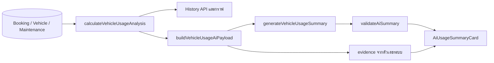

# บทที่ 4 — ตัวชี้วัด AI อีเมล และไฟล์สนับสนุน

## 1. Prisma Client กลาง

[lib/prisma.ts](/Users/chatchaponchuwongwut/Desktop/mut/project_1/vehicle-management/lib/prisma.ts) import dotenv, สร้าง PrismaPg adapter จาก DATABASE_URL แล้วสร้าง PrismaClient ที่ generate จาก schema

ใช้ `globalThis.prisma` เก็บ instance ระหว่างการพัฒนา เพื่อให้การโหลดโมดูลซ้ำจาก hot reload สามารถใช้ client เดิม ลดการสร้าง client ใหม่โดยไม่จำเป็น ตั้ง log ระดับ query/info/warn/error

รูปแบบ query ที่ต้องอ่านเป็น:

| Prisma | ความหมาย/ตัวอย่าง |
|---|---|
| `findUnique({where: {id}})` | หาแถวจาก unique key เช่น id หรือ email |
| `findFirst({where: ...})` | หาแถวแรกที่ตรงเงื่อนไข เช่น conflict |
| `findMany()` | อ่านหลายแถว |
| `select` | ระบุฟิลด์ที่ต้องการ เช่นไม่ส่ง password |
| `include` | ดึง relation เช่น vehicle.type มาด้วย |
| `create/update/delete` | เปลี่ยนหนึ่งรายการ |
| `updateMany/createMany/deleteMany` | เปลี่ยนหลายรายการตามเงื่อนไข |
| `count` / `_count` | นับแถวหรือ relation |
| `groupBy` | รวมเป็นกลุ่ม เช่นจำนวนซ่อมต่อรถ |
| `orderBy` | เรียงข้อมูล |
| `in`, `not`, `gte`, `lte`, `lt` | อยู่ในชุด ไม่เท่ากับ มากกว่าหรือเท่ากับ น้อยกว่าหรือเท่ากับ น้อยกว่า |
| relation `none` | ไม่มีรายการลูกที่ตรงเงื่อนไข เช่นรถที่ไม่มี booking ทับ |
| `$transaction` | รวมคำสั่ง DB ให้สำเร็จร่วมกันหรือ rollback เมื่อผิดพลาด |

```ts
include: {
  vehicle: { include: { type: true } },
  user: { select: { name: true, email: true } },
}
```

ผลลัพธ์จึงอ่านใน frontend ได้เป็น `booking.vehicle.type.name` และ `booking.user.name` ไม่จำเป็นต้องให้หน้าเว็บส่ง request แยกทุก relation

## 2. รายงานใช้โมดูลเดียวกับ AI

[lib/vehicle-usage-analysis/index.ts](/Users/chatchaponchuwongwut/Desktop/mut/project_1/vehicle-management/lib/vehicle-usage-analysis/index.ts) เป็น barrel file รวม exports จาก calculate, period และ types เพื่อให้ caller import จากชื่อโฟลเดอร์ได้

ตัวชี้วัดทั้งรายงานปกติและ endpoint AI ใช้ `calculateVehicleUsageAnalysis()` เหมือนกัน ต่างกันที่ผู้เรียกจะนำผลไปแสดงกราฟหรือแปลงเป็นข้อมูลส่งให้ AI จึงลดความเสี่ยงที่สองส่วนใช้สูตรคนละแบบ



## 3. period.ts — กำหนดช่วงวันเวลา

[period.ts](/Users/chatchaponchuwongwut/Desktop/mut/project_1/vehicle-management/lib/vehicle-usage-analysis/period.ts) รับ `startDate/endDate` รูปแบบ YYYY-MM-DD โดยต้องส่งทั้งคู่หรือไม่ส่งทั้งคู่ ค่าเริ่มต้นคือต้นเดือนถึงวันนี้ตาม Asia/Bangkok

| ฟังก์ชัน | รายละเอียด |
|---|---|
| `formatBangkokDate()` | format วันโดยระบุ timeZone ชัดเจน |
| `parseBangkokDate()` | ตรวจ regex, สร้างเวลา 00:00 +07:00 และตรวจย้อนกลับว่าเป็นวันที่เดิม |
| `addDays()` | เพิ่ม/ลดวันด้วย millisecond; ใช้กับบริบท Bangkok ในโมดูลนี้ |
| `resolveAnalysisPeriod()` | ตรวจคู่วัน ช่วงไม่กลับด้าน ไม่เกิน 366 วัน และสร้างช่วงเปรียบเทียบ |
| `isDateInPeriod()` | ตรวจ `date >= start && date < endExclusive` |
| `getBangkokWeekdayAndHour()` | แปลงเวลาเพื่อหาวันในสัปดาห์และชั่วโมงของไทย |

ตัวอย่างเลือก 1–7 กันยายน หมายถึงตั้งแต่ 1 ก.ย. 00:00 ถึงก่อน 8 ก.ย. 00:00 เวลาไทย รวม 7 วัน ช่วงเปรียบเทียบคือ 25–31 สิงหาคม มีจำนวนวันเท่ากันและติดกันพอดี ไม่ใช่ “เดือนก่อน” เสมอไป

การใช้ขอบเขตสิ้นสุดแบบ exclusive ช่วยไม่ต้องเขียน 23:59:59.999 และไม่ตกหล่นข้อมูลท้ายวัน ต่างจากสูตร inclusive overlap ของการจอง ซึ่งเป็นคนละวัตถุประสงค์

## 4. calculate.ts — คำนวณข้อมูลจริง

[calculate.ts](/Users/chatchaponchuwongwut/Desktop/mut/project_1/vehicle-management/lib/vehicle-usage-analysis/calculate.ts) อ่านรถทุกคันเพื่อรองรับ peer comparison แม้กำลังดูรถคันเดียว แล้วอ่าน booking COMPLETED ของช่วงวิเคราะห์รวมช่วงเปรียบเทียบ และงานซ่อมที่เริ่มในช่วงวิเคราะห์

ใช้ `returnedAt` ตัดสินว่าเที่ยวอยู่ในช่วงใด หากข้อมูลเก่าไม่มี returnedAt ใช้ endDate แทนและเพิ่มข้อจำกัดข้อมูล จากนั้นแบ่ง currentBookings และ previousBookings

`PENDING`, `APPROVED`, `CHANGED`, `IN_PROGRESS`, `REJECTED`, `CANCELLED` ไม่ถูกนับเป็นเที่ยวใช้งานจริงใน KPI นี้ ส่วน COMPLETED ที่ไม่มีเวลาคืนยังอาจถูกนับผ่าน fallback ไม่ได้ถูกตัดออกทุกกรณี

### ฟังก์ชันย่อยและสูตร

| ฟังก์ชัน | ทำอะไร |
|---|---|
| `round(value, digits=1)` | ปัดทศนิยมตามหลักที่กำหนด |
| `coverage(part, total)` | part/total × 100; ถ้า total=0 implementation คืน 100 |
| `percentChange(current, previous)` | (current−previous)/previous × 100; previous=0 คืน null |
| `median(values)` | เรียงและเลือกค่ากลาง หรือเฉลี่ยสองค่ากลาง |
| `getDistance(booking)` | ผลต่างเลขไมล์ หรือ null ถ้าขาดค่า/สิ้นสุดน้อยกว่าเริ่ม |
| `aggregateVehicle()` | รวมเที่ยว ระยะทาง ผู้ใช้ไม่ซ้ำ งานซ่อม และวันใช้ล่าสุด |
| `breakdownRate()` | breakdownCount / totalDistanceKm × 10,000; ไม่มีระยะทางบวกคืน null |
| `buildPeakUsage()` | หาวันในสัปดาห์และชั่วโมงที่เริ่มใช้รถมากที่สุด |
| `buildUserMetrics()` | รวมเที่ยวและระยะทางตาม userId |
| `calculateVehicleUsageAnalysis()` | ประสานทั้งหมดและคืนโครงสร้าง VehicleUsageAnalysis |

ตัวอย่างมี COMPLETED 3 เที่ยว: 100→150, 150→230, และไม่มีเลขไมล์ จะได้ usageCount=3, totalDistanceKm=130, validMileageTrips=2, avgDistancePerTripKm=65 ไม่ใช่ 130/3 เพราะเฉลี่ยจากเที่ยวที่มีหลักฐานระยะทาง

ยอดรวมระยะทางที่คืนเป็น number เกิดจากการรวมเฉพาะค่าที่ใช้ได้ ส่วนค่าที่หายถูกสะท้อนผ่าน coverage/dataLimitations อย่าอธิบายว่ายอดรวม 0 แปลว่ารถไม่วิ่งจริงในทุกกรณี

### ตัวชี้วัดรถ

| ฟิลด์ | ความหมาย |
|---|---|
| usageCount | จำนวน COMPLETED ในช่วง |
| totalDistanceKm / validMileageTrips | ผลรวมระยะทางที่ตรวจได้ / จำนวนเที่ยวที่เลขไมล์ใช้ได้ |
| avgDistancePerTripKm | ระยะทางรวม / เที่ยวที่มีเลขไมล์ใช้ได้ |
| uniqueUsersCount | จำนวน userId ไม่ซ้ำจาก Set |
| maintenanceCount | งานทุกประเภท/สถานะที่เริ่มในช่วง |
| breakdownCount / preventiveCount | จำนวนงานแยก BREAKDOWN / PREVENTIVE |
| breakdownRatePer10kKm | จำนวน BREAKDOWN ต่อ 10,000 กม. |
| previousUsageCount / usageChangePercent | เที่ยวก่อนหน้าและ % เปลี่ยนแปลง |
| peerMedian* | มัธยฐานกลุ่มรถประเภทเดียวกันเมื่อมีข้อมูลพอ |
| comparableVehicleCount | จำนวนรถที่เข้าเกณฑ์กลุ่ม |
| lastUsedAt | เวลาคืนล่าสุด หรือ endDate fallback ของเที่ยวในช่วง |
| currentMileage / currentStatus | สถานะปัจจุบันของรถ ไม่ใช่ snapshot ณ วันสิ้นสุดช่วงย้อนหลัง |

`maintenanceCount` ในกราฟมีทั้งซ่อมตามรอบและขัดข้อง จึงไม่ควรอ้างจำนวนนี้ทั้งหมดเป็นจำนวน “รถเสีย”

### เปรียบเทียบรถประเภทเดียวกัน

ระบบรวมตาม typeId รถเข้าเกณฑ์ต้องมี usageCount > 0 และ mileage coverage อย่างน้อย 80% เมื่อมีอย่างน้อย 3 คันจึงเผยแพร่มัธยฐานเที่ยวและระยะทาง ส่วนมัธยฐานอัตราซ่อมต้องมีอัตราที่คำนวณได้อย่างน้อย 3 ค่าอีกที

ตัวอย่างค่าระยะทาง 100, 120, 900 มัธยฐานคือ 120 ทำให้ค่าสุดโต่งกระทบน้อยกว่าค่าเฉลี่ย ใน implementation กลุ่มนี้อาจรวมรถเป้าหมายด้วยหากเข้าเกณฑ์ ไม่ใช่ “รถอื่นอีกสามคัน” เสมอ

ดูรถคันเดียว: metrics ผู้ใช้/ยอดรวมจำกัดเฉพาะรถคันนั้น แต่ยังคำนวณ peer median จากรถประเภทเดียวกัน ส่วนข้อมูลที่ส่ง AI ไม่มีรายละเอียดรายคันของรถนอกขอบเขตนั้น

### ตัวชี้วัดผู้ใช้

`buildUserMetrics()` รวมตาม userId แล้วได้ name, tripCount, totalDistanceKm, validMileageTrips, avgDistancePerTripKm, vehicleCount, mostUsedVehicleType, usageSharePercent, previousTripCount, tripCountChangePercent

เรียงจำนวนเที่ยวมากก่อน หากเท่ากันเรียงระยะทาง แล้วชื่อภาษาไทย ใช้ Set นับรถไม่ซ้ำและ Map นับประเภทที่ใช้มากที่สุด ข้อมูลผลคำนวณรวมผู้ใช้ทุกคนที่มีเที่ยวในขอบเขต ไม่มีคนที่ใช้ 0 เที่ยวอยู่ในรายการนี้

### ช่วงใช้รถสูงสุด

ใช้ pickedUpAt หรือ startDate เมื่อไม่มีเวลารับจริง แล้วนับวันในสัปดาห์ 0–6 และชั่วโมง 0–23 แยกกัน ถ้าเสมอเลือกค่าดัชนีน้อยกว่า มี estimatedStartTrips บอกจำนวนที่ใช้เวลาประมาณ

“Peak” นี้คือวันในสัปดาห์/ชั่วโมงเริ่มเที่ยวที่พบมากในชุดเที่ยวที่คืนในช่วงรายงาน ไม่ใช่จำนวนรถที่กำลังวิ่งพร้อมกันสูงสุด และไม่ใช่วันที่ปฏิทินหนึ่งวันโดยตรง

### คุณภาพข้อมูล

| ค่า | วิธีคิด |
|---|---|
| mileageCoveragePercent | เที่ยวที่เลขไมล์ใช้ได้ / เที่ยวทั้งหมด |
| actualPickupCoveragePercent | เที่ยวที่มี pickedUpAt / เที่ยวทั้งหมด |
| classifiedMaintenanceCoveragePercent | งานที่ไม่เป็น UNSPECIFIED / งานทั้งหมด |
| hasComparisonData | มีเที่ยวในช่วงก่อนหน้าหรือไม่ |
| hasSufficientMileageData / hasSufficientPickupData | coverage ถึง 80% หรือไม่ |

`dataLimitations` รวบรวมข้อจำกัด เช่นเลขไมล์ไม่ครบ ไม่มีช่วงเปรียบเทียบ เวลาคืนเป็นข้อมูล fallback หรือรถเทียบเคียงไม่พอ เมื่อไม่มีเที่ยว analysis route คืน NO_USAGE_DATA ก่อนเรียก AI แม้ coverage helper จะคืน 100 เมื่อไม่มี denominator

[types.ts](/Users/chatchaponchuwongwut/Desktop/mut/project_1/vehicle-management/lib/vehicle-usage-analysis/types.ts) กำหนดชนิด input/output เหล่านี้ให้โมดูลและ caller ใช้ตรงกัน ไม่ได้สร้างตารางเพิ่มเติม

## 5. รายละเอียดประวัติ — lib/vehicle-history-details/index.ts

[getVehicleHistoryDetails()](/Users/chatchaponchuwongwut/Desktop/mut/project_1/vehicle-management/lib/vehicle-history-details/index.ts) ใช้ resolveAnalysisPeriod ร่วมกับ KPI รับ tab/vehicleId/startDate/endDate/page/pageSize

`getPagination()` ตรวจ page >= 1 และ pageSize 1–100; `serializePeriod()` ส่งเฉพาะขอบเขตวันที่; `paginate()` ใช้ array.slice หลังโหลดข้อมูล ไม่ได้ใช้ Prisma skip/take จึงเป็นการแบ่งผลลัพธ์ฝั่งแอปในรุ่นนี้

| Tab | แหล่งข้อมูลและเงื่อนไขวันที่ |
|---|---|
| maintenance | Maintenance.startDate ในช่วง; ทุกประเภทและสถานะ |
| mileage | COMPLETED; returnedAt หรือ endDate เมื่อไม่มีเวลาคืน |
| trips | COMPLETED ใช้หลักเดียวกับ mileage; สถานะอื่นใช้ startDate |

`bookingEffectiveDate()` สร้างวันอ้างอิงตามหลักข้างต้น จากนั้น map distanceKm, เรียงล่าสุดก่อน แล้วแบ่งหน้า API ชั้นนอกตรวจ UUID และชื่อ tab ก่อนเรียกโมดูลนี้

## 6. AI แต่ละไฟล์ทำอะไร

### payload.ts — ส่งเฉพาะข้อมูลที่ต้องใช้

[buildVehicleUsageAiPayload()](/Users/chatchaponchuwongwut/Desktop/mut/project_1/vehicle-management/lib/ai/vehicle-usage-summary/payload.ts) รับ metrics ที่คำนวณแล้วและคืน 4 อย่าง:

| ผลลัพธ์ | ใช้ที่ไหน |
|---|---|
| payload | input ของโมเดล: period, scope, fleet, vehicles, users, peak, quality, limitations และ keys ที่อ้างได้ |
| evidence | แผนที่ key → label/value/unit/subject สำหรับตรวจอ้างอิงและแสดงเลข |
| users | แผนที่ u1/u2 → name เพื่อให้ UI เติมชื่อ |
| cacheKey | SHA-256 ของ JSON payload เพื่อ reuse ผลเมื่อ input เหมือนเดิม |

ใช้ `addEvidence()` สร้าง key เช่น `fleet.tripCount`, `vehicles.v1.usageCount`, `users.u1.tripCount` และให้ reference ชั่วคราว v1/u1 แทน internal id ในส่วนส่ง AI

ชื่อผู้ใช้และทะเบียนรถยังถูกส่งออกไปพร้อมข้อมูลรวมจริง จึงไม่ใช่ anonymous payload สิ่งที่ไม่ส่ง ได้แก่ email, password/token, internal userId, purpose/destination ของเที่ยว, description ของงานซ่อม และตัวผู้แจ้งซ่อม ข้อนี้ตรงกับ ADR 0001

SHA-256 ใช้เป็น fingerprint หา cache ไม่ได้ใช้เข้ารหัสข้อมูลที่ส่งไป provider และ cache key นี้ไม่ได้รวม model/prompt version โดยตรง

### prompt.ts — กติกาการเขียนบทสรุป

[VEHICLE_USAGE_SUMMARY_INSTRUCTIONS](/Users/chatchaponchuwongwut/Desktop/mut/project_1/vehicle-management/lib/ai/vehicle-usage-summary/prompt.ts) เป็นข้อความสั่งให้โมเดลสรุปไทยเป็นกลาง ใช้เฉพาะข้อมูลคำนวณจากระบบ เลือก evidence keys แทนเขียนตัวเลขเอง และใช้ userRef แทนพิมพ์ชื่อใน insight

ห้ามตีความว่าการใช้รถมากเป็นความผิด ห้ามสรุปเหตุ–ผลว่าผู้ใช้ทำรถเสีย ห้ามจัดรถให้บุคคลหรือสั่งเปลี่ยนข้อมูล และให้คัดลอก dataLimitations จาก input

Prompt เป็นแนวทางที่โมเดลต้องทำตาม ส่วนการบังคับตรวจหลังรับ response อยู่ใน schema/validate จึงไม่ควรบอกว่ามี prompt แล้วรับประกันถูกต้องทุกกรณี

### schema.ts — สัญญาผลลัพธ์

[VehicleUsageSummarySchema](/Users/chatchaponchuwongwut/Desktop/mut/project_1/vehicle-management/lib/ai/vehicle-usage-summary/schema.ts) ใช้ Zod กำหนด:

| Field | เนื้อหา |
|---|---|
| executiveSummary | ภาพรวมสั้น |
| vehicleUsageInsights | ข้อสังเกตรถ + evidenceMetricKeys |
| userUsageInsights | userRef + ข้อสังเกต + evidenceMetricKeys |
| maintenanceInsights | ข้อสังเกตงานซ่อม + evidenceMetricKeys |
| recommendations | recommendation/reason/evidenceMetricKeys |
| dataLimitations | ข้อจำกัดข้อมูล |

กำหนดความยาวข้อความและจำนวนรายการ เช่น insight แต่ละกลุ่ม 1–5 รายการ และ evidence keys ต่อรายการไม่เกิน 5

ข้อแตกต่างจากเป้าหมายใน CONTEXT: input รวมผู้ใช้ทั้งหมด แต่ schema output จำกัด userUsageInsights สูงสุด 5 และไม่มี validation บังคับให้ครอบคลุมทุก userRef ดังนั้นไม่ควรอธิบายว่าบทสรุปแสดงข้อความรายบุคคลครบทุกคนแน่นอนเมื่อมีเกิน 5 คน

### generate.ts — เรียก provider

[generateVehicleUsageSummary()](/Users/chatchaponchuwongwut/Desktop/mut/project_1/vehicle-management/lib/ai/vehicle-usage-summary/generate.ts) สร้าง client ผ่าน getOpenAiClient ซึ่งอ่าน OPENAI_API_KEY และ reuse instance ใช้ model จาก OPENAI_VEHICLE_SUMMARY_MODEL หรือ fallback string `gpt-5.6-luna` ตามโค้ด

เรียก `openai.responses.parse()` โดยส่ง instructions, JSON payload, `zodTextFormat(VehicleUsageSummarySchema, ...)`, reasoning low, verbosity low, max_output_tokens 1,800 และ store=false

นี่คือค่าการเรียกที่โค้ดกำหนด ไม่ใช่การยืนยันว่า credential/โมเดลใน environment ปัจจุบันเรียกสำเร็จ เพราะการอ่านและทดสอบครั้งนี้ไม่ได้ส่ง request จริงไป OpenAI

timeout ต่อครั้ง 30 วินาที ปิด SDK retries แล้ว loop ของแอปพยายามสูงสุด 2 ครั้ง หาก API error เป็น 400/401/403 หยุดทันที เมื่อ parse สำเร็จเรียก validateAiSummary แล้วคืนผลพร้อม model/generatedAt และ metadata เวลา attempts/tokens ถ้าทำไม่ได้ throw AiSummaryUnavailableError

### validate.ts — ตรวจคำตอบก่อนแสดง

[validateAiSummary()](/Users/chatchaponchuwongwut/Desktop/mut/project_1/vehicle-management/lib/ai/vehicle-usage-summary/validate.ts) ตรวจว่า evidence keys มีจริง, userRef มีจริง, prose ไม่มีตัวเลขที่ regex `\d` จับได้, ไม่มีชื่อผู้ใช้พิมพ์ตรง ๆ และไม่ตรง unsafePatterns ที่กำหนด

ตรวจ dataLimitations ว่ามาจากชุดที่อนุญาต แล้วแทนด้วยข้อจำกัดจากระบบทั้งหมด แม้ AI จะส่งกลับมาไม่ครบ

ขอบเขตการตรวจ: เป็น structured validation ร่วมกับ regex และ reference checking ไม่ใช่พิสูจน์ว่าความหมายของทุกประโยคถูกต้องทางตรรกะ เช่นคำบอกจำนวนที่เขียนเป็นตัวอักษรและข้ออ้างนอก regex ไม่ได้ถูกครอบคลุมเหมือนตัวเลข ASCII

### index.ts

[index.ts](/Users/chatchaponchuwongwut/Desktop/mut/project_1/vehicle-management/lib/ai/vehicle-usage-summary/index.ts) รวม exports ของ generator, error, payload และ type ที่ API caller ต้องใช้ หน้า UI import type จาก schema โดยตรงจึงไม่จำเป็นต้องโหลด generator ฝั่ง server ไปใช้งานใน browser

## 7. analysis route — ประสาน AI กับสิทธิ์และการจำกัดการใช้

[POST analysis](/Users/chatchaponchuwongwut/Desktop/mut/project_1/vehicle-management/app/api/admin/vehicles/history/analysis/route.ts) มีลำดับ:

1. requireAccess ด้วย ADMIN + REPORT_VIEW
2. ใช้ activeAdmins Set เป็นกลไกตั้งใจป้องกันงานพร้อมกันของคนเดียวใน process
3. Zod strict ตรวจ request: รับเฉพาะ vehicleId/startDate/endDate
4. คำนวณ metrics; เลือกรถที่ไม่มี → 404; ไม่มีเที่ยว → NO_USAGE_DATA
5. หา cache จาก hash ของข้อมูลรวม ถ้ามีส่ง cached=true
6. นับ Log action AI_USAGE_SUMMARY_REQUEST ของ Admin ในชั่วโมงล่าสุด ถ้าถึง 10 ตอบ 429
7. เรียก AI, เก็บ cache และเขียน metadata log
8. ส่ง READY หรือแปลง error และจัดการ finally

`summaryCache` เป็น Map ใน memory อายุ 10 นาที จำกัดประมาณ 100 entries; `getCachedSummary()` ลบค่าที่หมดอายุ; `setCachedSummary()` กวาดหมดอายุและลบ key เก่าเมื่อเต็ม ไม่ได้เก็บบทสรุปใน DB

`recordRun()` บันทึก model/status/latency/attempts/token counts/cacheHit โดยไม่บันทึก prompt หรือข้อความบทสรุป ถ้าเขียน log ไม่สำเร็จจะ catch และ console.error จึงไม่ควรอ้าง rate limit นี้ว่าเป็นระบบโควตาแบบรับประกันทุกกรณี

activeAdmins และ cache อยู่ใน process ไม่ใช่ distributed lock/cache ระหว่างหลาย server และต้องแยกคำว่า “ตั้งใจป้องกัน” ออกจากการรับประกัน concurrency ทั้งระบบ

ถ้า AI ล้มเหลว รายงานตัวเลขยังมาจาก endpoint ปกติ ไม่มีการแต่งบทสรุป fallback ขึ้นเองและไม่มีคำสั่งจัดรถหรือแก้ข้อมูลธุรกิจจาก output AI แต่ endpoint ยังเขียน operational Log ตามที่อธิบาย

## 8. อีเมลและ notification

### lib/email/service.ts

[sendEmail()](/Users/chatchaponchuwongwut/Desktop/mut/project_1/vehicle-management/lib/email/service.ts) คืน Promise<boolean> ถ้า EMAIL_ENABLED ไม่เท่ากับ string `"true"` คืน false ทันที `getSmtpConfig()` อ่าน SMTP_HOST/PORT/USER/PASS และ EMAIL_FROM; port default 587 และ secure=true เมื่อ port 465

`getTransporter()` สร้างและ reuse Nodemailer transporter; sendMail รับ from/to/subject/text/html เมื่อส่งล้มเหลว catch แล้วคืน false จึงไม่ throw SMTP error กลับไปล้มการจอง

ระบบนี้ส่งอีเมลใน request ที่กำลังทำอยู่ ไม่มี durable queue/worker หรือ retry delivery ในฐานข้อมูล ค่า false ส่วนใหญ่ไม่ได้ถูก caller แสดงให้ผู้ใช้ทราบ

### lib/email/templates.ts

[buildBookingEmail()](/Users/chatchaponchuwongwut/Desktop/mut/project_1/vehicle-management/lib/email/templates.ts) สร้าง `{subject, text, html}` สำหรับ APPROVED/REJECTED/CANCELLED/PICKED_UP/RETURNED/VEHICLE_CHANGED

`getActionDetail()` เลือกข้อความตามเหตุการณ์, `getVehicleName()` รวมทะเบียนและประเภท, `formatDateTime()` แปลงวัน, `escapeHtml()` แทน &, <, >, เครื่องหมายคำพูดก่อนแทรกข้อมูลใน HTML

แนบ purpose/destination, ช่วงจอง, เวลารับ–คืนจริงเมื่อมี และลิงก์ `/user/my-bookings` เมื่อ APP_BASE_URL ถูกกำหนด จึงต่างจาก AI payload ที่ไม่ส่ง raw purpose/destination

### lib/email/bookingNotifications.ts

[notifyBookingEvent()](/Users/chatchaponchuwongwut/Desktop/mut/project_1/vehicle-management/lib/email/bookingNotifications.ts) สร้าง Notification ใน DB ก่อน แล้วเรียก sendBookingEventEmail; `getBookingEventMessage()` สร้างข้อความไทยตามเหตุการณ์

`sendBookingEventEmail()` สร้าง template แล้วส่งให้ booking.user.email ใช้แยกใน change-vehicle เพราะ notification ถูกสร้างภายใน transaction ไปแล้ว จึงไม่สร้างซ้ำ

SMTP ล้มเหลวถูก service กลืนเป็น false แต่หาก `prisma.notification.create()` ล้มเหลว helper ยัง throw ได้ ต้องแยกสองส่วนนี้เมื่ออธิบาย error handling

### lib/email/maintenanceNotifications.ts

[buildMaintenanceReportEmail()](/Users/chatchaponchuwongwut/Desktop/mut/project_1/vehicle-management/lib/email/maintenanceNotifications.ts) ประกอบชื่อผู้แจ้ง อีเมล รถ รายละเอียด วันเริ่ม และลิงก์ `/admin/maintenance` พร้อม escape HTML

`emailAdminsAboutMaintenanceReport()` ส่งแยกแต่ละผู้รับด้วย Promise.allSettled เพื่อให้ความล้มเหลวของคนหนึ่งไม่หยุดการส่งให้คนอื่น ถูกเรียกหลัง transaction รายงานงานซ่อมสำเร็จ

## 9. format.ts

[format.ts](/Users/chatchaponchuwongwut/Desktop/mut/project_1/vehicle-management/lib/format.ts) มีฟังก์ชันคู่ status color/text สำหรับ Booking, Vehicle, Maintenance และ role แยก enum ภาษาอังกฤษที่เก็บใน DB ออกจากข้อความไทยกับ CSS class ที่แสดง

`formatDateTime`, `formatDate`, `formatDateTimeLong` ใช้ locale th-TH แต่ไม่ได้กำหนด timeZone Asia/Bangkok ทุกตัว จึงใช้ timezone ของ runtime ต่างจาก period.ts ที่กำหนด Bangkok ชัดเจน การ format ภาษาไทยไม่ใช่การบังคับ timezone ไทย

## 10. การทดสอบ

ผลที่รันระหว่างจัดทำคู่มือ: `npm test` ผ่าน 24 test files รวม 99 tests ส่วน `npm run lint` พบ 1 error และ 1 warning: explicit any ใน prisma/seed.ts และ unused DeepMockProxy ใน lib/__mocks__/prisma.ts ผลนี้ไม่ได้แปลว่าทุกเส้นทางของเว็บถูกทดสอบครบ

ไม่ได้รัน E2E, build, migrate หรือส่งอีเมล/เรียก AI จริงในงานอธิบายนี้ จึงไม่ใช้ผล unit tests ยืนยันสิ่งเหล่านั้น

### Vitest และ mock

[vitest.config.ts](/Users/chatchaponchuwongwut/Desktop/mut/project_1/vehicle-management/vitest.config.ts) ตั้ง environment node, globals=true และ alias @ ให้ชี้ root

[lib/__mocks__/prisma.ts](/Users/chatchaponchuwongwut/Desktop/mut/project_1/vehicle-management/lib/__mocks__/prisma.ts) ใช้ mockDeep<PrismaClient>() และ reset ก่อนแต่ละ test เป็น utility ที่มีให้ใช้ แต่ tests ปัจจุบันจำนวนมากประกาศ Prisma mock เฉพาะไฟล์ด้วย vi.hoisted/vi.fn แทน ไม่ควรอธิบายว่าทุก test ใช้ shared mock นี้

รูปแบบทดสอบที่พบ:

```ts
vi.mock("@/lib/prisma", () => ({ prisma: prismaMock }))
prismaMock.booking.findMany.mockResolvedValue(rows)
const response = await GET(request)
expect(response.status).toBe(200)
expect(await response.json()).toEqual(rows)
```

คือเตรียมสถานการณ์จำลอง → เรียก handler จริง → ตรวจผลและการเรียก dependency จึงทดสอบกฎของ route โดยไม่ต้องเชื่อม DB/SMTP/provider จริง ส่วน test ที่ mock requireAccess ก็ไม่ได้ทดสอบ auth จริงใน test นั้น ต้องอ่าน auth/permissions tests ประกอบ

| กลุ่มไฟล์ทดสอบ | ตรวจเรื่องใด |
|---|---|
| app/api/auth/login/__tests__ | ไม่พบผู้ใช้ รหัสผิด cookie และ inactive |
| lib/__tests__/auth.test.ts | role ล่าสุดจาก DB และ token ของบัญชีที่ถูกปิด |
| lib/__tests__/permissions.test.ts | role/permission และความต่าง 401/403 |
| app/api/booking/__tests__ | เจ้าของรายการ ช่วงซ้ำ สร้าง/ยกเลิก แก้และล้าง destination |
| app/api/approver/__tests__ | เหตุผลปฏิเสธ อนุมัติ และ request ซ้ำ |
| app/api/admin/bookings/__tests__ | กันข้ามขั้นตอนเลขไมล์ผ่านแก้สถานะ |
| app/api/admin/bookings/change-vehicle/__tests__ | transaction เปลี่ยนรถ เงื่อนไขรถเดิม และรถใหม่ไม่ว่าง |
| app/api/user/__tests__ | lifecycle ประวัติการลบ และ Admin คนสุดท้าย |
| app/api/verhicle/__tests__ | เลขไมล์และการลบรถที่มีประวัติ |
| app/api/verhicle-type/__tests__ | CRUD ประเภทและสิทธิ์ |
| app/api/user/maintenance/__tests__ | สร้างรายงาน แจ้ง Admin และประเภทจำเป็น |
| app/api/admin/maintenance/__tests__ | affected bookings รายละเอียดปิดงาน ค่าใช้จ่ายและวันที่ |
| app/api/admin/permissions/__tests__ | แทนเมทริกซ์พร้อม audit และ locked permissions |
| app/api/notifications/__tests__ | อ่าน/แก้เฉพาะผู้รับปัจจุบัน |
| lib/vehicle-usage-analysis/__tests__ | สูตร ช่วงไทย ช่วงเปรียบเทียบ peers และข้อมูลขาด |
| lib/vehicle-history-details/__tests__ | tab, effective date, pagination และ mileage null |
| app/api/admin/vehicles/history/details/__tests__ | ตรวจ filters/tab/permission |
| app/api/admin/vehicles/history/analysis/__tests__ | Admin/no-data/request strict/rate limit/metadata |
| lib/ai/vehicle-usage-summary/__tests__ | ขอบเขต payload/hash และ validation output |
| lib/email/__tests__ | template, escape HTML, SMTP config และ fail behavior |

### Playwright

[playwright.config.ts](/Users/chatchaponchuwongwut/Desktop/mut/project_1/vehicle-management/playwright.config.ts) ใช้ Chromium, worker เดียว, ไม่ fullyParallel, timeout test 90 วินาที, เก็บ trace/screenshot เมื่อ fail เลือก baseURL จาก PLAYWRIGHT_BASE_URL หรือ localhost และสามารถเปิด dev server ให้เองโดยปิด EMAIL_ENABLED

| E2E file | Scenario |
|---|---|
| e2e/admin-vehicle-mileage.e2e.ts | Admin แก้เลขไมล์รถ |
| e2e/admin-booking-mileage.e2e.ts | Admin รับ–คืนรถพร้อมเลขไมล์แทน User |
| e2e/booking-destination.e2e.ts | เก็บ แสดง แก้และล้างปลายทาง |
| e2e/phase6-emergency.e2e.ts | User แจ้งฉุกเฉินและ Admin เปลี่ยนรถ |

E2E มีการเตรียม/ล้างข้อมูลผ่าน pg และใช้ browser ทำงานจริง ต่างจาก Vitest ที่ mock dependency

## 11. Config และเอกสารอื่น

| ไฟล์ | หน้าที่ |
|---|---|
| package.json | scripts dev/build/start/lint/test/test:watch/test:e2e และ dependency declarations |
| package-lock.json | ล็อก dependency tree เพื่อความสม่ำเสมอในการติดตั้ง |
| tsconfig.json | strict=true, noEmit=true, JSX, module resolution bundler และ @/* → root |
| next.config.ts | export NextConfig ที่ยังไม่มี custom option |
| next-env.d.ts | declarations ที่ Next สร้างเพื่อให้ TypeScript รู้ type ของ framework |
| postcss.config.mjs | ใช้ @tailwindcss/postcss |
| eslint.config.mjs | กฎ Next core-web-vitals/TypeScript และโฟลเดอร์ที่ ignore |
| prisma.config.ts | schema/migrations/seed command และ DB URL ของ CLI |
| docker-compose.yml | PostgreSQL 15, port 5432 และ volume pgdata เก็บข้อมูลข้าม container restart |
| .env.example | ชื่อตัวแปร DB/JWT/SMTP/AI; เป็นตัวอย่าง ไม่ใช่ยืนยันค่าที่กำลังรัน |
| README.md | ข้อมูลเริ่มต้นของ Next.js เป็นหลัก |
| PRODUCT.md | วัตถุประสงค์ ผู้ใช้และแนวทางผลิตภัณฑ์ |
| DESIGN.md | แนวทางสี typography components และ UI |
| PROJECT_2_STATUS.md | รายงานความคืบหน้าที่เขียนไว้ ณ ช่วงหนึ่ง ไม่ใช่ผลทดสอบสด |
| CONTEXT.md | คำศัพท์และนิยามของโดเมน โดยเฉพาะ metrics กับ AI |
| docs/plans/ai-vehicle-usage-summary.md | แผนและ acceptance ของงาน AI |
| docs/adr/0001-... | เหตุผลการส่งชื่อและข้อมูลรวมที่จำเป็นให้ AI และการไม่เก็บเนื้อหาถาวร |
| docs/adr/0002-... | เหตุผลแยก AI ออกจากการคำนวณตัวเลขและการสั่งงานธุรกิจ |
| AGENTS.md | แนวทางสำหรับผู้ช่วยพัฒนา repository ไม่ใช่โค้ด runtime |
| skills-lock.json และ .agents/skills | ข้อมูลเครื่องมือช่วยพัฒนา ไม่ได้กำหนดสิทธิ์ User ของระบบรถ |
| app/favicon.ico | ไอคอนเว็บ |
| public/* | static assets; อ้างด้วย URL จาก root เช่น /pea_logo.png |

ค่าฐานข้อมูลตัวอย่างใน .env.example และ docker-compose.yml ไม่ตรงกันทั้งหมด จึงต้องกำหนด DATABASE_URL ให้ตรง instance ที่เลือกใช้จริง ห้ามตีความว่ารัน compose แล้วแอปเชื่อมได้ทันทีโดยไม่ตั้งค่า

ตัวแปร `NEXT_PUBLIC_*` มีไว้ใช้ใน client ได้ เช่น URL ของ API ส่วน DATABASE_URL/JWT_SECRET/OPENAI_API_KEY/SMTP_PASS เป็นค่าฝั่ง server คู่มือนี้ไม่ได้อ่านหรือคัดลอก secret จาก .env
